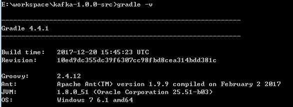
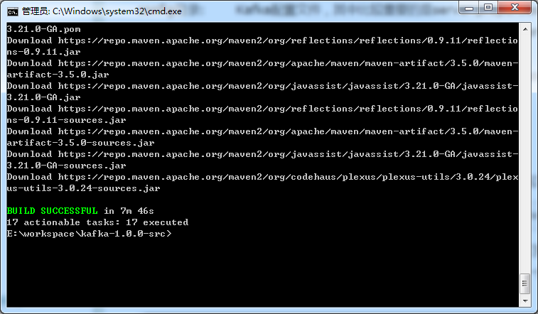
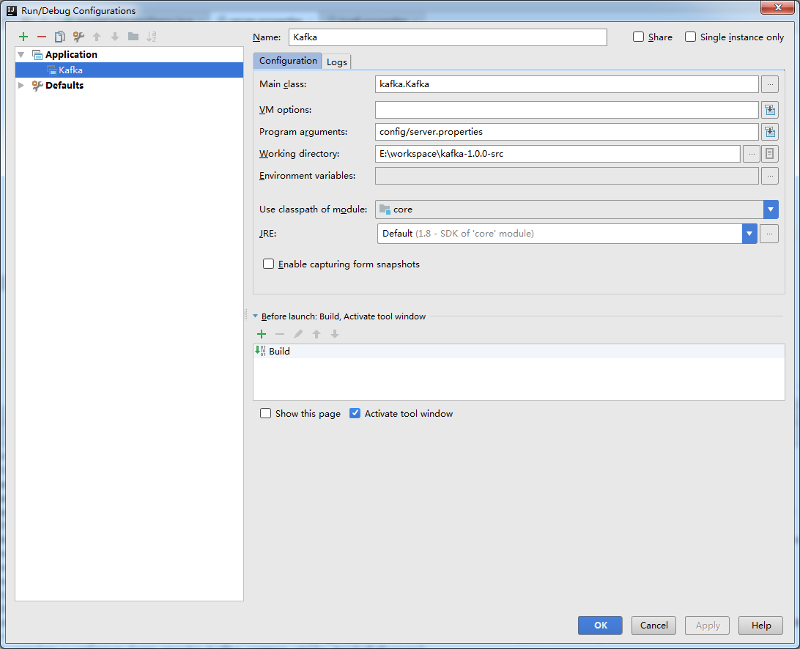

Kafka是一种分布式的，基于发布/订阅的消息系统。主要设计目标如下：

* 以时间复杂度为O(1)的方式提供消息持久化能力，即使对TB级以上数据也能保证常数时间复杂度的访问性能
* 高吞吐率。即使在非常廉价的商用机器上也能做到单机支持每秒100K条以上消息的传输
* 支持Kafka Server间的消息分区，及分布式消费，同时保证每个Partition内的消息顺序传输
* 同时支持离线数据处理和实时数据处理
* Scale out：支持在线水平扩展

<!-- more -->

## Gradle安装配置

Kafka使用Gradle进行编译和构建，因此首先需要安装Gradle。从官网下载最新的Gradle，解压至一个目录，然后创建一个GRADLE_HOME环境变量指向这个目录，再将%GRADLE_HOME%\bin加到PATH环境变量中，Gradle就安装配置好了。



## Kafka源码导入

在 Kafka 目录中执行 `gradle idea` 生成 IDEA 工程文件。如果是第一次运行，可能会花费一些时间去下载必要的jar包，在等待了一段时间之后，终于看到了BUILD SUCCESSFUL的字样表示项目工程文件生成成功。



之后就可以使用 IDEA 打开工程了。

## 配置server.properties

kafka broker启动时需要加载server.properties文件。该文件默认位置是在config目录下，因此需要设置运行kafka.Kafka时的Program arguments为config/server.properties，以保证Kafka能够找到该配置文件。

另外，由于kafka broker会将一些元数据信息保存在zookeeper中，因此在启动kafka broker之前必须要先有一个启动着的zookeeper实例或集群。我们还需要在server.properties文件更新zookeeper连接信息:

```
############################# Zookeeper #############################

# Zookeeper connection string (see zookeeper docs for details).
# This is a comma separated host:port pairs, each corresponding to a zk
# server. e.g. "127.0.0.1:3000,127.0.0.1:3001,127.0.0.1:3002".
# You can also append an optional chroot string to the urls to specify the
# root directory for all kafka znodes.
zookeeper.connect=10.148.21.177:2181/kafka

# Timeout in ms for connecting to zookeeper
zookeeper.connection.timeout.ms=6000
```

可以使用zookeeper的chroot方式，为Kafka单独划分一个命名空间，避免直接在zookeeper的根目录创建Kafka的节点。

## 启动Kafka

在 IDEA 中点击 `Edit Configuration`，按照如下配置



## log4j.properties文件路径设置

启动kafka server很奇怪，可能会抱一个log4j.properties文件找不到的错误。

解决方法是把log4j.properties放置到src/main/scala路径下。