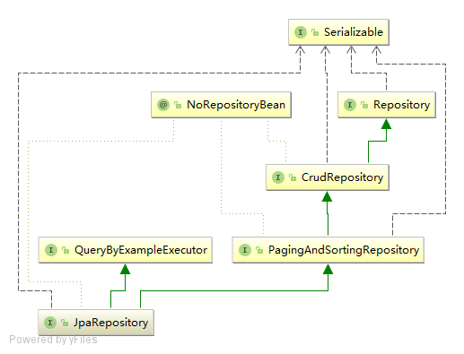
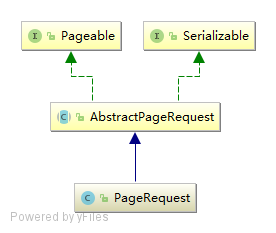

在上文中，我们谈到 JpaRepository 继承自 gingAndSortingRepository 和 QueryByExampleExecutor ，它的继承关系如下图所示：



`PagingAndSortingRepository` 中提供了 findAll 方法，处理分页和排序的操作。

```
@NoRepositoryBean
public interface PagingAndSortingRepository<T, ID extends Serializable> extends CrudRepository<T, ID> {
    Iterable<T> findAll(Sort var1);

    Page<T> findAll(Pageable var1);
}
```

`CrudRepository` 提供了基本的增删改查方法。

```
@NoRepositoryBean
public interface CrudRepository<T, ID extends Serializable> extends Repository<T, ID> {
    <S extends T> S save(S var1);

    <S extends T> Iterable<S> save(Iterable<S> var1);

    T findOne(ID var1);

    boolean exists(ID var1);

    Iterable<T> findAll();

    Iterable<T> findAll(Iterable<ID> var1);

    long count();

    void delete(ID var1);

    void delete(T var1);

    void delete(Iterable<? extends T> var1);

    void deleteAll();
}
```

`QueryByExampleExecutor` 提供了自定义维度查询的方法。

```
public interface QueryByExampleExecutor<T> {
    <S extends T> S findOne(Example<S> var1);

    <S extends T> Iterable<S> findAll(Example<S> var1);

    <S extends T> Iterable<S> findAll(Example<S> var1, Sort var2);

    <S extends T> Page<S> findAll(Example<S> var1, Pageable var2);

    <S extends T> long count(Example<S> var1);

    <S extends T> boolean exists(Example<S> var1);
}
```

下面我们看一下上述功能如何使用。

# 分页和排序

在 JPA 中实现分页和排序十分简单，`PagingAndSortingRepository` 中提供了相关实现。

分页时我们只需要提供一个 `Pageable` 的对象即可。 `Pageable` 是一个接口，定义了分页操作所需要的信息：

```
public interface Pageable {
    int getPageNumber();

    int getPageSize();

    int getOffset();

    Sort getSort();

    Pageable next();

    Pageable previousOrFirst();

    Pageable first();

    boolean hasPrevious();
}
```

Spring JPA 中提供了一个默认的 `Pageable` 实现 `PageRequest` ，它的继承关系如下图所示：



`AbstractPageRequest` 是一个 `Pageable` 的抽象类实现，从构造函数中我们可以看到，页码是从第 0 页开始的：

```
public AbstractPageRequest(int page, int size) {
    if (page < 0) {
        throw new IllegalArgumentException("Page index must not be less than zero!");
    } else if (size < 1) {
        throw new IllegalArgumentException("Page size must not be less than one!");
    } else {
        this.page = page;
        this.size = size;
    }
}
```

`PageRequest` 除了 page 和 size 的参数外，还可以指定排序相关的参数：

```
public PageRequest(int page, int size, Direction direction, String... properties) {
    this(page, size, new Sort(direction, properties));
}

public PageRequest(int page, int size, Sort sort) {
    super(page, size);
    this.sort = sort;
}
```

一个简单的分页和排序的使用例子：

```
public Page<User> queryPage(Integer page, Integer size) {
    Sort sort = new Sort(Sort.Direction.DESC, "createTime");
    return userRepository.findAll(new PageRequest(page, size, sort));
}
```

# 使用 QueryByExampleExecutor 查询

基于 `QueryByExampleExecutor` 可以实现自定义维度的查询。

```
public List<User> getUserByPhone(String phone) {
    User example = new User();
    example.setPhone(phone);
    return userRepository.findAll(Example.of(example));
}
```
