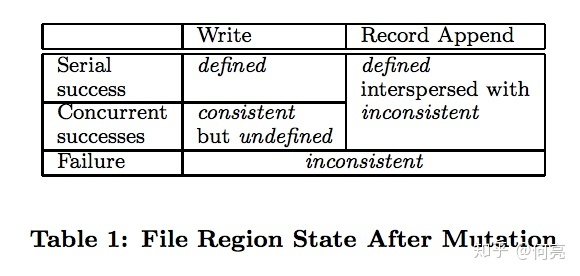
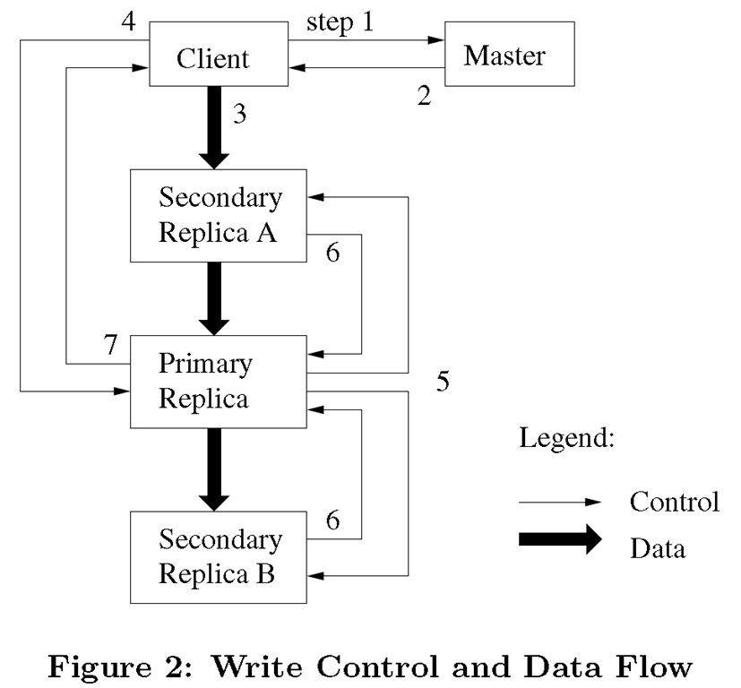
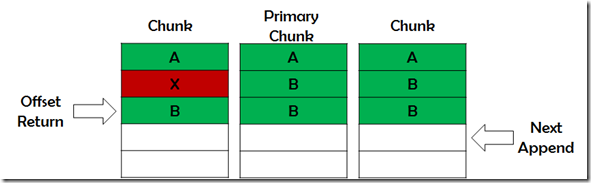

6.824的第二篇论文是同样大名鼎鼎的[GFS](http://nil.csail.mit.edu/6.824/2018/papers/gfs.pdf)。

GFS为MapReduce提供了存储，没有GFS也就没有MapReduce。同时Google的其他系统也是构建在GFS之上，例如BigTable、Spanner。Apache Hadoop中的HDFS就是GFS的模仿之作。同时，GFS也是一篇非常值得一读的系统结构方向的文章，文中的多副本机制、容错、控制流与数据流隔离、追加写模式等概念几乎成为分布式文件系统的标配。

## 应用场景

GFS是一个分布式的文件系统。它不追求与POSIX接口兼容，而是使用自己的一套API。它对主要应用场景的假设也与传统单机文件系统不同：

* 系统用大量普通机器堆起来，机器挂掉是非常常见的事。
* 系统里面主要存的是大文件，几百M甚至上G这种大小。
* 读操作是大量的顺序读和少量的随机读。
* 写操作是大量的顺序写(append)，一旦写入几乎不会修改。
* 文件经常被大量client同时append，需要仔细考虑同步机制的开销
* 相比低latency，更看重高吞吐量

## 系统架构

* GFS由一个master和多个chunkserver组成。
* master存储整个文件系统的元数据，chunkserver存储实际文件数据。
* 文件被分为固定大小的chunk（例如64MB），每个chunk有一个全局唯一的64位编号，每个chunk会备份在多个chunkserver上（默认3个），以一个普通Linux文件的方式。
* master会通过周期性的心跳消息来向chunkserver发送指令和收集状态。
* client和chunkserver均不缓存文件数据。

## master设计

单节点master的设计会存在single point failure的问题，作者对此的解释是，首先单节点master大大简化了系统设计和实现，其次数据直接在client和chunkserver之间交流所以单master不会成为瓶颈。

master内存中会存储三类元数据：文件和chunk的命名空间、文件到chunk的映射以及每个chunk副本的位置。前两类元数据持久化存储到master本地磁盘上的operation log中，并在其他机器（remote machine）备份；master不会存储chunk的位置信息，而是向每个chunkserver询问得来，因为每个chunkserver知道自己的状态，免去了这一可能造成不一致的可能性。

上面提交的master的log非常重要，所以我们要保证先把操作写入log并备份到远程机器后，再对用户可见，和数据库的write-ahead log是一个意思。为了加速挂掉之后的重启速度，会定期作checkpoint，这样重启时只要重跑自上次checkpoint以后的log就行了。

## 一致性模型

出于性能考虑，GFS并不是强一致性的，它做出的保证如下：文件metadata的操作（比如改名）是原子操作，这一点由master里仔细加锁就可以保证。

GFS中文件内容的修改有两种，一种是write，可以理解为在指定offset位置处的随机写；另一种是record append，即在文件末尾处的追加写。根据前文所述应用场景，record append操作占据绝大多数。

* 修改失败：不一致
* 串行随机写：一致且已定义
* 并行随机写：非原子写，一致但未定义
* 串行/并行追加写（推荐）：少量不一致，保证已定义

关于一致、已定义、未定义的概念，[这里](https://www.zhihu.com/question/20485173)有篇文章介绍的很细致。

> consistent（一致的）意思就是所有用户在查询同一个chunk的时候，看到的结果是一样的，不管他是从该chunk的哪一个replica（我们知道每个chunk都有几个replica），而不会出现A读了replica1, B读了replica2, 而A和B的结果不相同，要知道无论哪个replica都是同一个chunk的。
>
> defined（定义的）这个词字面上不好理解，相信也是题主的困惑所在。首先，defined就包含了consistent，即如果一个chunk是defined，就一定是consistent的；其次，用户能够看到每一次mutation实际进行了什么操作写了什么数据。这是什么意思呢？这就牵扯出GFS的record append操作了以下是论文原话：
>
>> Data mutations may be writes or record appends. A write causes data to be written at an application-specified file offset. A record append causes data (the "record") to be append atomically at least once even in presence of concurrent mutations, but at an offset of GFS's choosing.
>
> 好了，write操作是由用户指定offset，那在并发的情况下，就有可能导致用户采用它觉得合理的offset，而实际上会导致并发写入的数据相互混合，这样，我们就无从得知这一堆混合的数据里，都是哪些操作分别写入了哪部分数据。但是在读的时候，又确实是相同的结果，此为 undefined but consistent
>
> 而在实际的GFS场景中，record append是主要的操作（而不是write），GFS保证record append是atomic的，（至于这个at least once，我个人的理解是和append出错后保证客户端重试，直到每个record都是被原子地插入过一次）。原子化写入，配合GFS的operation log，就能够确定哪些数据是哪些操作写入的。继续往下读论文的 Lease and Mutation Order部分，我们知道，并发的mutation是被序列化并以相同顺序在各相关chunkserver中执行的。
>
>> The primary assigns consecutive serial numbers to all the mutations it receives, possibly from multiple clients, which provides the necessary serialization.
>
> 要知道，write操作由于不同用户指定了offset，系统是无法为其序列化的。而对于record append，GFS负责数据的offset并将其返回给用户。
>
> 至于defined interspersed with inconsistent，就是那个at least once的结果，mutation在一些replica可能会失败而导致操作重试，或者因为重试导致的重复数据，或者会有一些无关数据填充（为了fit on 每个chunk的固定大小），所以会有一定量的inconsistent，但是，对于这种inconsistent，GFS是有相应措施去处理的，比如使用checksum和通过identifier忽略重复的record。

## 系统交互

1. client向master节点询问哪一个chunk服务器持有当前的租约，以及其它副本的位置。如果没有一个chunk持有租约，master节点就选择其中一个副本建立一个租约（这个步骤在图上没有显示）。
2. master节点将主chunk的标识符以及其它副本（又称为secondary副本、二级副本）的位置返回给client。client缓存这些数据以便后续的操作。只有在主chunk不可用，或者主chunk回复信息表明它已不再持有租约的时候，client才需要重新跟master节点联系。
3. client把数据推送到所有的副本上。client可以以任意的顺序推送数据。chunk服务器接收到数据并保存在它的内部LRU缓存中，一直到数据被使用或者过期交换出去。由于数据流的网络传输负载非常高，通过分离数据流和控制流，我们可以基于网络拓扑情况对数据流进行规划，提高系统性能，而不用去理会哪个chunk服务器保存了主chunk。
4. 当所有的副本都确认接收到了数据，client发送写请求到主chunk服务器。这个请求标识了早前推送到所有副本的数据。主chunk为接收到的所有操作分配连续的序列号，这些操作可能来自不同的client，序列号保证了操作顺序执行。它以序列号的顺序把操作应用到它自己的本地状态中。
5. 主chunk把写请求传递到所有的二级副本。每个二级副本依照主chunk分配的序列号以相同的顺序执行这些操作。
6. 所有的二级副本回复主chunk，它们已经完成了操作。
7. 主chunk服务器回复client。任何副本产生的任何错误都会返回给client。在出现错误的情况下，写入操作可能在主chunk和一些二级副本执行成功。（如果操作在主chunk上失败了，操作就不会被分配序列号，也不会被传递。）客户端的请求被确认为失败，被修改的region处于不一致的状态。我们的client代码通过重复执行失败的操作来处理这样的错误。在从头开始重复执行之前，client会先从步骤（3）到步骤（7）做几次尝试。

## 原子记录追加

GFS提供了一种原子的数据追加操作–记录追加。传统方式的写入操作，客户程序会指定数据写入的偏移量。对同一个region的并行写入操作不是串行的：region尾部可能会包含多个不同client写入的数据片段。使用记录追加，client只需要指定要写入的数据。GFS保证至少有一次原子的写入操作成功执行（即写入一个顺序的byte流），写入的数据追加到GFS指定的偏移位置上，之后GFS返回这个偏移量给client。这类似于在Unix操作系统编程环境中，对以O_APPEND模式打开的文件，多个并发写操作在没有竞态条件时的行为。

追加写的过程：

如果追加操作会使Chunk超过尺寸，则

* 填充当前Chunk；
* 通知二级副本做同样操作；
* 通知client向新Chunk追加；

如果追加操作不会使Chunk超过尺寸，则

* 主Chunk追加数据；
* 通知二级副本写在相同位置上；
* 成功 - 返回偏移； 失败 - 再次操作。

追加结果：失败的追加操作可能导致Chunk间字节级别不一致，但当最终追加成功后，所有副本在返回的偏移位置一致已定义，之后的追加操作不受影响。如下图所示：

所以，GFS并不保证字节级别的一致性，它只保证数据作为一个整体记录被原子性的被至少写入一次。

冗余数据处理：

* 对于追加写产生的冗余数据，Chunk尺寸不足时的填充数据，追加失败时产生的重复内容，
* 可在插入数据时附带记录级别的Checksum或唯一标识符，在客户端读取数据时进行校验过滤。

## 快照

GFS中生成快照的方式叫copy-on-write。也就是说，文件的备份在某些时候只是将快照文件指向原chunk，增加对chunk的引用计数而已，等到chunk上进行了写操作时，Chunk Server才会拷贝chunk块，后续的修改操作落到新生成的chunk上。快照实现的过程：

* 收回文件所有Chunk的租约；
* 操作元数据完成元数据拷贝；
* 客户端要写入该文件的Chunk时，Master通知该Chunk所在ChunkServer进行本地拷贝；

## Master节点的操作

### 名称空间管理和锁

多操作并行，名称空间锁保证执行顺序，文件操作需获得父目录读锁和目标文件/目录写锁。

不同于许多传统文件系统，GFS没有针对每个目录实现能够列出目录下所有文件的数据结构。GFS也不支持文件或者目录的链接（即Unix术语中的硬链接或者符号链接）。在逻辑上，GFS的名称空间就是一个全路径和元数据映射关系的查找表。利用前缀压缩，这个表可以高效的存储在内存中。在存储名称空间的树型结构上，每个节点（绝对路径的文件名或绝对路径的目录名）都有一个关联的读写锁。

### 副本位置

Chunk跨机架分布：

好处：

* 防止整个机架破坏造成数据失效
* 综合利用多机架整合带宽（机架出入带宽可能小于机架上机器的总带宽，所以应最大化每台机架的带宽利用率）；

坏处：写操作需跨机架通信。

### Chunk管理

Chunk的副本有三个用途：Chunk创建，重新复制和重新负载均衡。

1. Chunk的创建操作，主要考虑：

	* 平衡硬盘使用率；
	* 限制单ChunkServer短期创建次数（创建开销虽小，但每次创建往往意味着大量的后续写入）；
	* 跨机架分布。

2. 重复制，即有效副本不足时，通过复制增加副本数。优先考虑：

	* 副本数量和复制因数相差多的；
	* live（未被删除）文件的；
	* 阻塞client处理的

	Chunk进行重复制。策略与创建类似。为了防止克隆产生的网络流量大大超过client的流量，Master节点对整个集群和每个Chunk服务器上的同时进行的克隆操作的数量都进行了限制。另外，Chunk服务器通过调节它对源Chunk服务器读请求的频率来限制它用于克隆操作的带宽。

3. 重负载均衡，通过调整副本位置，平衡格机负载。策略与创建类似。新ChunkServer将被逐渐填满。