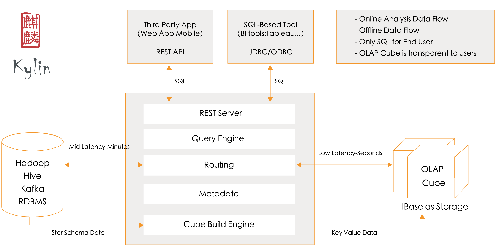

Apache Kylin是一个开源的分布式OLAP引擎，提供基于Hadoop/Spark之上的SQL查询接口以及多维分析能力，支持超大规模的数据集，能够在亚秒内查询巨大的Hive表。Apache Kylin最初由eBay开发并贡献至开源社区。



***

出于学习和研究的目的，建议使用集成的sandbox来安装Apache Kylin，避免在Hadoop环境上浪费时间。这里选择了CDH的sandbox环境。

下载好CDH sandbox并导入Virtual Box之后，启动虚拟机即可得到一个配置好的HDFS、YARN、MapReduce、Hive、Hbase、Zookeeper等软件的运行环境。

从官网下载Kyelin二进制安装包:

```
cd /usr/local
wget http://mirrors.tuna.tsinghua.edu.cn/apache/kylin/apache-kylin-2.4.0/apache-kylin-2.4.0-bin-cdh57.tar.gz
```

解压tar包，并配置环境变量`KYLIN_HOME`:

```
tar -zxvf apache-kylin-2.4.0-bin-cdh57.tar.gz
cd apache-kylin-2.4.0-bin-cdh57
export KYLIN_HOME=`pwd`
```

为确保用户有权限执行hadoop、hive和hbase的相关命令，可以运行`$KYLIN_HOME/bin/check-env.sh`命令检查环境配置，如果没有error信息，意味着环境没有问题。

运行 `$KYLIN_HOME/bin/kylin.sh start` 脚本来启动 Kylin ，服务器启动后，可以通过查看 `$KYLIN_HOME/logs/kylin.log` 获得运行时日志。

Kylin 启动后可以通过浏览器 http://hostname:7070/kylin 查看。初始用户名和密码是 ADMIN/KYLIN。

运行 `$KYLIN_HOME/bin/kylin.sh stop` 脚本，停止 Kylin。