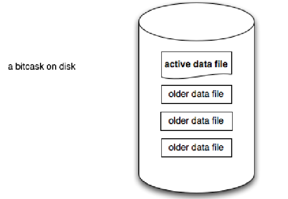
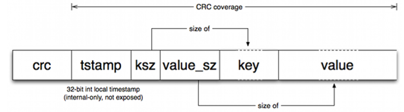
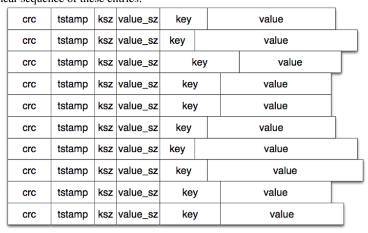
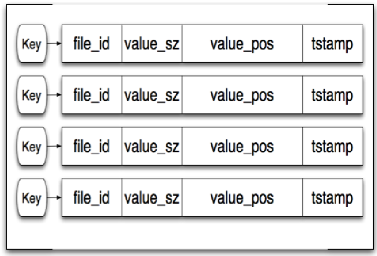
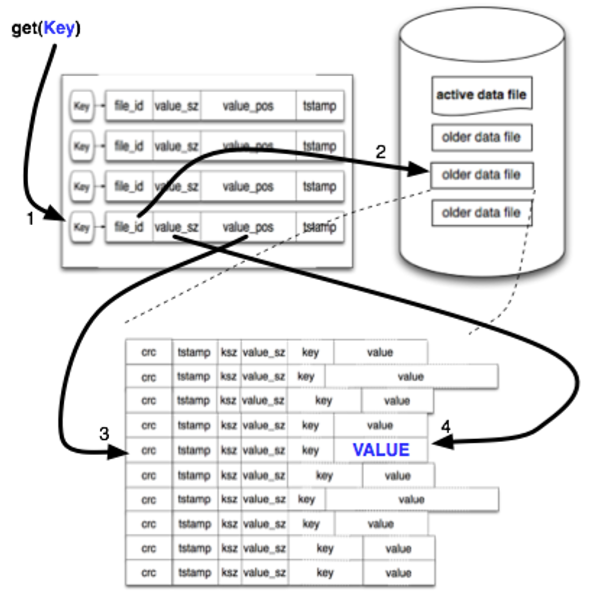
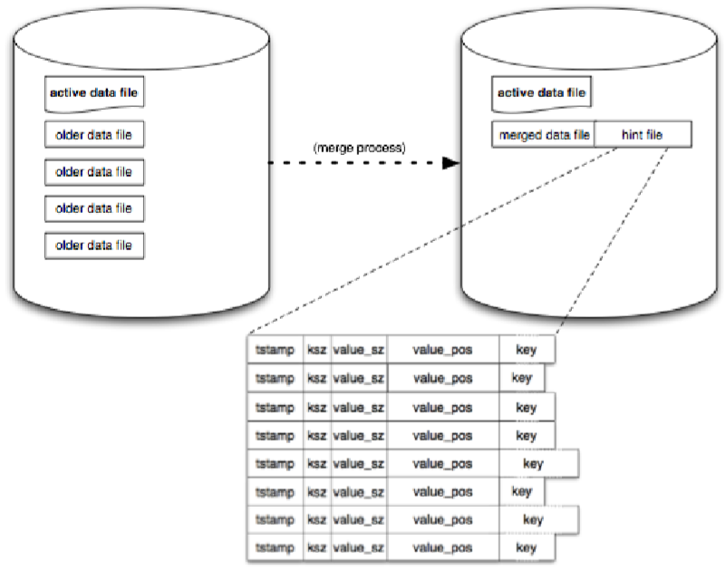

Bitcask 是一个日志型的键值对存储引擎。最初 Bitcask 是作为 Riak 这样一个分布式存储系统的核心存储引擎被人知晓，之后豆瓣的 beansdb 也使用 Bitask 的存储模型。

Bitcask 的论文可以从官网或 Github 中找到。说论文不太合适，或者应该叫说明文档，因为模型设计比较简单，实在没什么可着重阐述。

# 日志型存储

与常见基于 B+ 树的存储引擎不同，日志型的存储引擎不支持随机写，而只支持 Append-Only 写入。由于将硬盘的随机写转化为顺序写，因此日志型的存储引擎能够提高写入的吞吐量，因为硬盘没有seek的过程，直接追加即可。

在 Bitcask 中，数据被以追加的方式写入硬盘的数据文件中，数据文件只增不减。硬盘不可能有无限容量，数据文件也就不可能无限制写入。当文件增加到一定大小时，就会产生一个新的文件，老的文件只读不写。因此，在任意一个时刻，只会有一个文件允许写入数据。在 Bitbask 中，称为活动文件（active file）。

文件中数据的格式也十分简单，依次由crc校验码、时间戳、key的大小、value的大小、key、value组成：

数据删除也是通过另一次写入实现，删除时写入的value是一个特殊值，标记为删除，这个特殊值Bitcask称为“墓碑”。

数据文件的内容如下图所示。

数据可能被多次写入和删除，因此数据文件中会存在大量无用的数据记录。Bitcask有一个merge的过程，会定期将历史上的数据文件全部扫描一遍，生成一个新的数据文件。注意，merge的过程不包括active文件，因为它还在不断地写入。merge的过程，实际上就是对同一个key的多个value合并的过程，merge后只保留这个key最新的value；如果这个key被标记为删除，新的数据文件中也不再包含这个key。每次merge后，新的数据文件中就不再有冗余数据了。

# 索引

连续写入数据的方式提高了写操作的吞吐量，但对读操作并不友好，如果要查询某个key现在只能从所有文件中查找。因此，Bitcask设计了一个内存中的hash索引结构，用于加速读操作。

索引的结构如下：

索引中每个key有三个元素可用来定位value所在，分别是file_id、value_pos、value_sz，于是可以通过file_id找到value所在的文件、通过value_pos找到value在这个文件中的偏移量、从偏移量开始读value_sz大小的数据，就得到了value。

过程如下：

# 线索文件

索引是内存中的数据结构，Bitcask重启时需要在内存重建索引。如果数据量特别大，重建索引的过程将非常耗时。Bitcask使用了线索文件（hint file）用来加速这一过程。线索文件在merge完成后被创建，索引文件的数据结构与数据文件类似，不同的是数据文件记录的是只，而索引文件记录的是数据的位置。

启动的时候就可以不读数据文件，而是读线索文件，按行重建即可，大大加快了索引的重建速度。

# 小结

Bitcask是一个设计十分精简的日志型键值对存储引擎。

* 添加：新添加的数据直接追加到活动文件中。随着活动文件越来越大，当达到一定大小时Bitcask会停止写当前的活动文件，新建一个新的文件作为活动文件，之前的文件只能读不能再写入。
* 删除：Bitcask不会直接删除记录，而是新增一条新的记录，将key标记为删除。然后更改索引中的哈希表。
* 修改：Bitcask不支持随机写入，因此修改时不是在原记录上直接修改value，而是新增一条记录，value为新值。然后同步修改索引中的哈希表。
* 查询：读取时，首先从索引的哈希表中定位到记录的位置，然后通过磁盘IO读取对应的记录。
* 合并：Bitcask只增不减的特性，必然会导致数据不断膨胀。Bitcask提供了merge的操作，剔除数据中无用的部分，包括已删除的数据、修改过留下的历史数据。merge只针对非活动文件，因为活动文件目前还在不断的被写入。merge后还会生成一个线索文件，用于重启时加速内存中索引的重建。