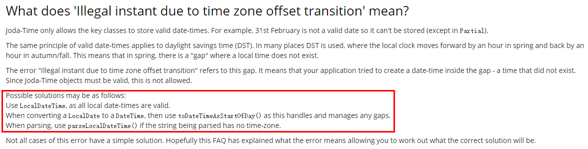
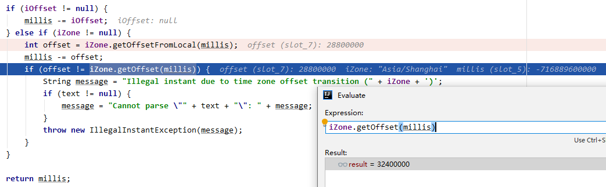
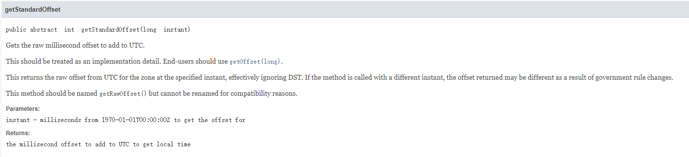
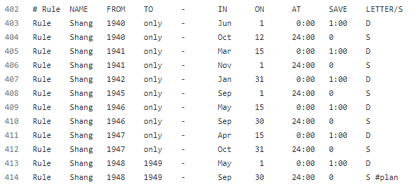

最近线上遇到一个比较奇怪的问题，查下来还是挺有意思的，奇怪的知识又增加了。

## 起

线上服务有一个功能是从身份证号判断是否成年，具体做法是从身份证号截取出出生年月，然后判断是否大于18岁。功能比较简单，一直也没什么问题，直到昨天遇到一个日期解析的异常。

```
org.joda.time.IllegalInstantException: Cannot parse "19470415": Illegal instant due to time zone offset transition (Asia/Shanghai) 
at org.joda.time.format.DateTimeParserBucket.computeMillis(DateTimeParserBucket.java:473) 
at org.joda.time.format.DateTimeParserBucket.computeMillis(DateTimeParserBucket.java:411) 
at org.joda.time.format.DateTimeFormatter.parseDateTime(DateTimeFormatter.java:928)
......
```

`19470415`这个字符串格式正确，但用`joda`解析的时候就抛了异常。如下是解析的代码：

```java
DateTime birthTime = DateTimeFormat.forPattern("yyyyMMdd").parseDateTime(birth);
DateTime adultTime = DateTime.now().plusYears(-18);
return adultTime.compareTo(birthTime) == 1;
```

从异常信息上看，估计是和时区有关。网上搜索了下，在`joda`的文档中已经写明了如何解决：



把`DateTime`换成`LocalDateTime`后果然解决了。

```java
LocalDateTime birthTime = DateTimeFormat.forPattern("yyyyMMdd").parseLocalDateTime(birth);
LocalDateTime adultTime = LocalDateTime.now().plusYears(-18);
return adultTime.compareTo(birthTime) == 1;
```

解决后我开始尝试探究这背后的深层原因。

## 承

我尝试从`1990年1月1日`到今日，逐个尝试进行日期的解析，结果也很奇怪，只有几天会出现这种异常：

```
19400601 parse fail, Cannot parse "19400601": Illegal instant due to time zone offset transition (Asia/Shanghai)
19410315 parse fail, Cannot parse "19410315": Illegal instant due to time zone offset transition (Asia/Shanghai)
19420131 parse fail, Cannot parse "19420131": Illegal instant due to time zone offset transition (Asia/Shanghai)
19460515 parse fail, Cannot parse "19460515": Illegal instant due to time zone offset transition (Asia/Shanghai)
19470415 parse fail, Cannot parse "19470415": Illegal instant due to time zone offset transition (Asia/Shanghai)
19480501 parse fail, Cannot parse "19480501": Illegal instant due to time zone offset transition (Asia/Shanghai)
19490501 parse fail, Cannot parse "19490501": Illegal instant due to time zone offset transition (Asia/Shanghai)
```

这几天到底有什么不一样，才会如此的特殊？这一切的背后到底是人性的扭曲，还是道德的沦丧？

异常抛出的位置在`joda`中`DateTimeParserBucker`类的`computeMillis`方法：

```java
......

if (iOffset != null) {
    millis -= iOffset;
} else if (iZone != null) {
    int offset = iZone.getOffsetFromLocal(millis);
    millis -= offset;
    if (offset != iZone.getOffset(millis)) {
        String message = "Illegal instant due to time zone offset transition (" + iZone + ')';
        if (text != null) {
            message = "Cannot parse \"" + text + "\": " + message;
        }
        throw new IllegalInstantException(message);
    }
}

......
```

`millis`是根据日期字符串计算出的一个时间戳，`iZone`表示时区，不设置的话则用机器设置的时区，在上例中是`Asia/Shanghai`。`getOffsetFromLocal`方法返回的是一个偏移量，本地时间减去这个偏移量就可以得到`UTC`时间。`getOffset`方法返回的也是偏移量，`UTC`时间加上这个偏移量就可以得到一个本地时间。在上面`joda`的判断中，先调用`getOffsetFromLocal`从本地时间`millis`计算一个偏移量`offset`，`millis`减去`offset`后就是一个`UTC`时间；再调用`getOffset`从`UTC`时间计算出一个偏移量，正常来讲，这两个偏移量应该是一致的，如果不一致就会抛出异常。



在`19470415`这个例子中，`getOffsetFromLocal`计算结果是`28800000`毫秒，即`8`个小时；`getOffset`方法计算结果则是`32400000`毫秒，即9个小时。这1个小时又是从何而来？

## 转

看下`getOffset`方法的注释：



`getOffset`返回的偏移量可能由于夏令时或政策原因而不同！

继续翻看`joda`的代码，在`org.joda.time.tz.src`中包含了一组时区相关的代码，这是来自`iana`的时区数据内容。`iana Time Zone Database`可以在[这里](https://www.iana.org/time-zones)下载。

我们找到`joda`中`asia`的时区数据，[代码地址](https://github.com/JodaOrg/joda-time/blob/master/src/main/java/org/joda/time/tz/src/asia)。以`Shanghai`为关键字，搜索到这么一组数据：



这组日期有点眼熟啊，这就是之前日期解析异常那组日期吗？

细看前面的注释，大概意思就是历史上因为采用过夏令时，或者战争等因素，导致某些历史上的某些时间段，`Asia/Shanghai`时间与`UTC`时间的时区间隔可能不同。这段注释很有意思，引用连接也能看到一些有意思的故事，比如1919年天津曾经短暂的施行过夏令时制度，给老百姓折腾的够呛，后来又改回来了。

`iana`的时区数据怎么读呢？详细规则可以参考[这里](https://data.iana.org/time-zones/tz-how-to.html)。最后一列的`D`表示`CDT`，即夏令时；`S`表示`CST`，即标准时。大概猜测下这个数据的读法，以我们服务触发的异常例子`1947年04月15日`为例，在4月15日的0点0分，采用夏令时，时间调整为1点。于是，相较于`UTC`时间，多出了一个小时。

## 合

终于，我们知道这多的一个小时从何而来。知道真相的我，真的想骂街。

---

题外话：夏令时真是个绝绝子的发明，如果是为了节约能源，明明修改作息就能解决的事，改来改去搞的很多东西都错乱了。