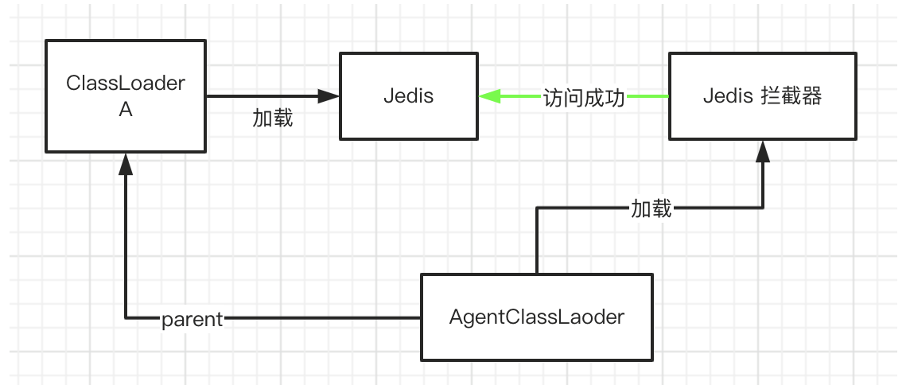

`org.apache.skywalking.apm.agent.SkyWalkingAgent`是Skywalking Agent的启动入口。`premain`方法的主要流程：

1. 调用`SnifferConfigInitializer.initializeCoreConfig`加载配置
2. 使用`PluginBootstrap`的`loadPlugins`方法加载插件，并创建`PluginFinder`实例
3. 创建`Transformer`，构建`Byte Buddy`的`AgentBuilder`，并与`Instrumentation`关联
4. 调用`ServiceManager.boot`方法，初始化`BootService`

```java
public static void premain(String agentArgs, Instrumentation instrumentation) throws PluginException {
    final PluginFinder pluginFinder;
    try {
        // 1. 加载配置
        SnifferConfigInitializer.initializeCoreConfig(agentArgs);
    } catch (Exception e) {
        // try to resolve a new logger, and use the new logger to write the error log here
        LogManager.getLogger(SkyWalkingAgent.class)
                .error(e, "SkyWalking agent initialized failure. Shutting down.");
        return;
    } finally {
        // refresh logger again after initialization finishes
        LOGGER = LogManager.getLogger(SkyWalkingAgent.class);
    }

    try {
        // 2. 加载插件
        pluginFinder = new PluginFinder(new PluginBootstrap().loadPlugins());
    } catch (AgentPackageNotFoundException ape) {
        LOGGER.error(ape, "Locate agent.jar failure. Shutting down.");
        return;
    } catch (Exception e) {
        LOGGER.error(e, "SkyWalking agent initialized failure. Shutting down.");
        return;
    }

    // 3. 创建Byte Buddy Transformer
    final ByteBuddy byteBuddy = new ByteBuddy().with(TypeValidation.of(Config.Agent.IS_OPEN_DEBUGGING_CLASS));

    AgentBuilder agentBuilder = new AgentBuilder.Default(byteBuddy).ignore(
            nameStartsWith("net.bytebuddy.")
                    .or(nameStartsWith("org.slf4j."))
                    .or(nameStartsWith("org.groovy."))
                    .or(nameContains("javassist"))
                    .or(nameContains(".asm."))
                    .or(nameContains(".reflectasm."))
                    .or(nameStartsWith("sun.reflect"))
                    .or(allSkyWalkingAgentExcludeToolkit())
                    .or(ElementMatchers.isSynthetic()));

    JDK9ModuleExporter.EdgeClasses edgeClasses = new JDK9ModuleExporter.EdgeClasses();
    try {
        agentBuilder = BootstrapInstrumentBoost.inject(pluginFinder, instrumentation, agentBuilder, edgeClasses);
    } catch (Exception e) {
        LOGGER.error(e, "SkyWalking agent inject bootstrap instrumentation failure. Shutting down.");
        return;
    }

    try {
        agentBuilder = JDK9ModuleExporter.openReadEdge(instrumentation, agentBuilder, edgeClasses);
    } catch (Exception e) {
        LOGGER.error(e, "SkyWalking agent open read edge in JDK 9+ failure. Shutting down.");
        return;
    }

    if (Config.Agent.IS_CACHE_ENHANCED_CLASS) {
        try {
            agentBuilder = agentBuilder.with(new CacheableTransformerDecorator(Config.Agent.CLASS_CACHE_MODE));
            LOGGER.info("SkyWalking agent class cache [{}] activated.", Config.Agent.CLASS_CACHE_MODE);
        } catch (Exception e) {
            LOGGER.error(e, "SkyWalking agent can't active class cache.");
        }
    }

    agentBuilder.type(pluginFinder.buildMatch())
                .transform(new Transformer(pluginFinder))
                .with(AgentBuilder.RedefinitionStrategy.RETRANSFORMATION)
                .with(new RedefinitionListener())
                .with(new Listener())
                .installOn(instrumentation);

    PluginFinder.pluginInitCompleted();

    try {
        // 4. 初始化BootService
        ServiceManager.INSTANCE.boot();
    } catch (Exception e) {
        LOGGER.error(e, "Skywalking agent boot failure.");
    }

    Runtime.getRuntime()
            .addShutdownHook(new Thread(ServiceManager.INSTANCE::shutdown, "skywalking service shutdown thread"));
}
```

# 加载配置

[`SnifferConfigInitializer`](https://github.com/apache/skywalking-java/blob/main/apm-sniffer/apm-agent-core/src/main/java/org/apache/skywalking/apm/agent/core/conf/SnifferConfigInitializer.java)类负责完成Agent配置的初始化。`initializeCoreConfig`方法完成核心配置的初始化，大致流程：

1. 创建一个名为`AGENT_SETTINGS`的`Properties`实例，用于暂存从各处加载的配置参数
2. 从配置文件中加载参数到`AGENT_SETTINGS`
    * 如果指定了`skywalking_config`环境变量，则从`skywalking_config`环境变量指定的路径加载
    * 否则从`/config/agent.config`路径加载，这是一个相对于`agent.jar`文件的相对路径
```java
private static InputStreamReader loadConfig() throws AgentPackageNotFoundException, ConfigNotFoundException {
    String specifiedConfigPath = System.getProperty(SPECIFIED_CONFIG_PATH);
    File configFile = StringUtil.isEmpty(specifiedConfigPath) ? new File(
        AgentPackagePath.getPath(), DEFAULT_CONFIG_FILE_NAME) : new File(specifiedConfigPath);

    if (configFile.exists() && configFile.isFile()) {
        try {
            LOGGER.info("Config file found in {}.", configFile);

            return new InputStreamReader(new FileInputStream(configFile), StandardCharsets.UTF_8);
        } catch (FileNotFoundException e) {
            throw new ConfigNotFoundException("Failed to load agent.config", e);
        }
    }
    throw new ConfigNotFoundException("Failed to load agent.config.");
}
```
3. 从环境变量中加载参数到`AGENT_SETTINGS`
    * 只加载key以`skywalking.`开头的环境变量，如`Config.Agent.SERVICE_NAME`配置，在`agent.config`中的参数key是`agent.service_name`，环境变量的key则为`skywalking.agent.service_name`
    * 这一步加载的参数会覆盖上一步已加载的参数
```java
private static void overrideConfigBySystemProp() {
    Properties systemProperties = System.getProperties();
    for (final Map.Entry<Object, Object> prop : systemProperties.entrySet()) {
        String key = prop.getKey().toString();
        if (key.startsWith(ENV_KEY_PREFIX)) {
            String realKey = key.substring(ENV_KEY_PREFIX.length());
            AGENT_SETTINGS.put(realKey, prop.getValue());
        }
    }
}
```
4. 从命令行参数中加载参数到`AGENT_SETTINGS`
    * 命令行传参为`-javaagent:<agent.jar>=<args>`，参数格式类似`key1=value1,key2=value2`
    * 这一步加载参数同样会覆盖前两步已加载的参数
```java
    ......
    agentOptions = StringUtil.trim(agentOptions, ',');
    if (!StringUtil.isEmpty(agentOptions)) {
        try {
            agentOptions = agentOptions.trim();
            LOGGER.info("Agent options is {}.", agentOptions);

            overrideConfigByAgentOptions(agentOptions);
        } catch (Exception e) {
            LOGGER.error(e, "Failed to parse the agent options, val is {}.", agentOptions);
        }
    }
    ......
```
5. 使用已加载的参数`AGENT_SETTINGS`初始化`Config`类，这一步是通过调用[`ConfigInitializer.initialize`](https://github.com/apache/skywalking-java/blob/HEAD/apm-commons/apm-util/src/main/java/org/apache/skywalking/apm/util/ConfigInitializer.java)方法完成
    * 初始化是通过反射逐个为每个属性设置值，仅会处理`public`和`static`修饰的属性
    * 获取参数key时会统一转换为小写，因此前3步中设置的参数key需要注意必须为小写，否则不会被使用
    * 处理时会根据参数的数据结构分不同情况处理，如：Map、Collection、Object等
    * `Config`中的配置如果是`String`类型，那么会有一个`@Lenght`注解设置字符串的最大长度，初始化时已加载的参数value如果过长会被截断
6. 校验`Config`配置是否正确
    * `Config.Agent.SERVICE_NAME`不能为空
    * `Config.Collector.BACKEND_SERVICE`不能为空
7. 设置`IS_INIT_COMPLETED`变量为`true`，表示初始化完成

# 加载插件

## PluginBootstrap

[`PluginBootstrap`](https://github1s.com/apache/skywalking-java/blob/HEAD/apm-sniffer/apm-agent-core/src/main/java/org/apache/skywalking/apm/agent/core/plugin/PluginBootstrap.java)类负责完成插件的加载。主要流程：

1. 调用`AgentClassLoader.initDefaultLoader`完成默认`AgentClassLoader`类加载器的初始化
```java
public static void initDefaultLoader() throws AgentPackageNotFoundException {
    if (DEFAULT_LOADER == null) {
        synchronized (AgentClassLoader.class) {
            if (DEFAULT_LOADER == null) {
                DEFAULT_LOADER = new AgentClassLoader(PluginBootstrap.class.getClassLoader());
            }
        }
    }
}
```
2. 调用`PluginResourcesResolver.getResources`加载插件类路径下的所有`skywalking-plugin.def`文件，注意这里使用的是默认`AgentClassLoader`类加载器，原因后面会说
```java
public List<URL> getResources() {
    ......
    urls = AgentClassLoader.getDefault().getResources("skywalking-plugin.def");
    ......
}
```
3. 调用`PluginCfg.load`方法加载并解析第2步得到的`skywalking-plugin.def`文件，
    * 每个插件的信息被封装为一个`PluginDefine`对象。`skywalking-plugin.def`文件的内容是一个`=`分隔的字符串，key表示插件名，对应`PluginDefine`中的name属性，value表示插件类路径，对应`PluginDefine`中的`defineClass`属性
    ```
    httpclient-3.x=org.apache.skywalking.apm.plugin.httpclient.v3.define.HttpClientInstrumentation
    ```
    * `PluginSelector`会对上一步加载到的所有插件做一次过滤，如果在`Config.Plugin.EXCLUDE_PLUGINS`参数中设置了插件名，这一步会将其排除掉
```java
void load(InputStream input) throws IOException {
    try {
        BufferedReader reader = new BufferedReader(new InputStreamReader(input));
        String pluginDefine;
        while ((pluginDefine = reader.readLine()) != null) {
            try {
                if (pluginDefine.trim().length() == 0 || pluginDefine.startsWith("#")) {
                    continue;
                }
                PluginDefine plugin = PluginDefine.build(pluginDefine);
                pluginClassList.add(plugin);
            } catch (IllegalPluginDefineException e) {
                LOGGER.error(e, "Failed to format plugin({}) define.", pluginDefine);
            }
        }
        pluginClassList = pluginSelector.select(pluginClassList);
    } finally {
        input.close();
    }
}
```
4. 遍历上一步加载到的插件列表，通过反射方式创建插件，注意此时使用的仍然是默认的`AgentClassLoader`类加载器
```java
    ......
    for (PluginDefine pluginDefine : pluginClassList) {
    try {
        LOGGER.debug("loading plugin class {}.", pluginDefine.getDefineClass());
        AbstractClassEnhancePluginDefine plugin = (AbstractClassEnhancePluginDefine) Class.forName(pluginDefine.getDefineClass(), true, AgentClassLoader
            .getDefault()).newInstance();
        plugins.add(plugin);
    } catch (Throwable t) {
        LOGGER.error(t, "load plugin [{}] failure.", pluginDefine.getDefineClass());
    }
    ......
}
```

## AgentClassLoader

前文提到了默认`AgentClassLoader`的初始化。[AgentClassLoader](https://github1s.com/apache/skywalking-java/blob/HEAD/apm-sniffer/apm-agent-core/src/main/java/org/apache/skywalking/apm/agent/core/plugin/loader/AgentClassLoader.java)是Skywalking Agent实现的一个自定义类加载器，专门用于插件的类加载。

为什么需要一个自定义的类加载器呢？我们知道Skywalking Agent的初衷就是无侵入式的探针操作，应用不会显式地添加Skywalking依赖，因此应用的类加载器`AppClassLoader`就加载不到Skywalking的插件。

`AgentClassLoader`加载`plugins`和`activations`两个目录下的插件：

```java
public AgentClassLoader(ClassLoader parent) throws AgentPackageNotFoundException {
    super(parent);
    File agentDictionary = AgentPackagePath.getPath();
    classpath = new LinkedList<>();
    Config.Plugin.MOUNT.forEach(mountFolder -> classpath.add(new File(agentDictionary, mountFolder)));
}

public class Config {
    public static class Plugin {
        /**
         * Mount the folders of the plugins. The folder path is relative to agent.jar.
         */
        public static List<String> MOUNT = Arrays.asList("plugins", "activations");
    }
}
```

`AgentClassLoader`构造方法被调用的入口有两个，除了`AgentClassLoader.initDefaultLoader`方法（即前面分析的`PluginBootstrap.loadPlugins`方法中）有调用外，还会在`InterceptorInstanceLoader.load`方法中被调用。

`InterceptorInstanceLoader`用于加载插件拦截器。拦截器`interceptor`是用于实现增强逻辑的实际载体，拦截器类似于`AOP`中的`advice`。

`InterceptorInstanceLoader`其内部使用了一个`INSTANCE_CACHE`变量（类型为`ConcurrentHashMap`）的缓存插件实例，`load`方法中首先会在缓存中查找，已有实例就直接返回，没有则创建一个新实例。`InterceptorInstanceLoader`内部同样有一个`EXTEND_PLUGIN_CLASSLOADERS`变量用于缓存`ClassLoader`，创建实例时会从缓存中查找`ClassLoader`，如果缓存中没有则会创建一个新的`AgentClassLoader`并放入缓存中。

```java
public static <T> T load(String className,
    ClassLoader targetClassLoader) throws IllegalAccessException, InstantiationException, ClassNotFoundException, AgentPackageNotFoundException {
    if (targetClassLoader == null) {
        targetClassLoader = InterceptorInstanceLoader.class.getClassLoader();
    }
    String instanceKey = className + "_OF_" + targetClassLoader.getClass()
                                                                .getName() + "@" + Integer.toHexString(targetClassLoader
        .hashCode());
    Object inst = INSTANCE_CACHE.get(instanceKey);
    if (inst == null) {
        INSTANCE_LOAD_LOCK.lock();
        ClassLoader pluginLoader;
        try {
            pluginLoader = EXTEND_PLUGIN_CLASSLOADERS.get(targetClassLoader);
            if (pluginLoader == null) {
                pluginLoader = new AgentClassLoader(targetClassLoader);
                EXTEND_PLUGIN_CLASSLOADERS.put(targetClassLoader, pluginLoader);
            }
        } finally {
            INSTANCE_LOAD_LOCK.unlock();
        }
        inst = Class.forName(className, true, pluginLoader).newInstance();
        if (inst != null) {
            INSTANCE_CACHE.put(instanceKey, inst);
        }
    }

    return (T) inst;
}
```

有一个细节很有意思，`InterceptorInstanceLoader`内部缓存的key是用`className`和`targetClassLoader`共同构建的，这也就意味着，同样一个插件的拦截器，会为每个`targetClassLoader`创建一个`AgentClassLoader`，其`parent`是`targetClassLoader`。哪些可能是`targetClassLoader`呢？比如，`sun.misc.Launcher$AppClassLoader`、`org.springframework.boot.loader.LaunchedURLClassLoader`，或者业务/第三方jar中自定义的`ClassLoader`。

为什么要新建一个`AgentClassLoader`实例而不用默认的`AgentClassLoader`呢？默认的`AgentClassLoader`的`parent`是`AppClassLoader`。考虑这样一种场景，假设`Jedis`是由一个自定义类加载器加载的，且插件中又访问了`Jedis`这个类，因为`AgentClassLoader`是无法访问到`Jedis`这个类文件的，因此只能向上查找，向上查找到`AppClassLoader`，肯定是查不到的，因为`Jedis`是自定义类加载器加载的。


而如果我们使用一个新的 AgentClassLoader，并将其 parent 设置为 Jedis 的 ClassLoader，则可以解决这个问题。



## PluginFinder

`PluginFinder`主要实现了插件的查找。`PluginFinder`内部维护了`nameMatchDefine`、`signatureMatchDefine`、`bootstrapClassMatchDefine`几个变量，用于存储插件实例。

`PluginFinder`构造方法传入了一个`AbstractClassEnhancePluginDefine`的`List`，来源是`PluginBootstrap.loadPlugins`方法的返回。构造方法遍历插件列表依次处理：

1. 调用`enchanceClass`方法，返回一个`ClassMatch`类型的对象，表示该插件的拦截点，即要被增强的类，如果返回为空则忽略该插件
2. 如果返回的是`ClassMatch`的子类`NameMatch`，那么加入到`nameMatchDefine`中，否则加入到`signatureMatchDefine`
3. 如果是`Bootstrap`插件，则加入到`bootstrapClassMatchDefine`中

```java
public PluginFinder(List<AbstractClassEnhancePluginDefine> plugins) {
    for (AbstractClassEnhancePluginDefine plugin : plugins) {
        ClassMatch match = plugin.enhanceClass();

        if (match == null) {
            continue;
        }

        if (match instanceof NameMatch) {
            NameMatch nameMatch = (NameMatch) match;
            LinkedList<AbstractClassEnhancePluginDefine> pluginDefines = nameMatchDefine.get(nameMatch.getClassName());
            if (pluginDefines == null) {
                pluginDefines = new LinkedList<AbstractClassEnhancePluginDefine>();
                nameMatchDefine.put(nameMatch.getClassName(), pluginDefines);
            }
            pluginDefines.add(plugin);
        } else {
            signatureMatchDefine.add(plugin);
        }

        if (plugin.isBootstrapInstrumentation()) {
            bootstrapClassMatchDefine.add(plugin);
        }
    }
}
```

当进行类增强时，会调用`find`方法查找插件，分别在`nameMatchDefine`和`signatureMatchDefine`中查找匹配到的插件并返回：

```java
public List<AbstractClassEnhancePluginDefine> find(TypeDescription typeDescription) {
    List<AbstractClassEnhancePluginDefine> matchedPlugins = new LinkedList<AbstractClassEnhancePluginDefine>();
    String typeName = typeDescription.getTypeName();
    if (nameMatchDefine.containsKey(typeName)) {
        matchedPlugins.addAll(nameMatchDefine.get(typeName));
    }

    for (AbstractClassEnhancePluginDefine pluginDefine : signatureMatchDefine) {
        IndirectMatch match = (IndirectMatch) pluginDefine.enhanceClass();
        if (match.isMatch(typeDescription)) {
            matchedPlugins.add(pluginDefine);
        }
    }

    return matchedPlugins;
}
```

`PluginFinder`中还有一个`buildMatch`方法，该方法会将`nameMatchDefine`和`signatureMatchDefine`中的所有插件用`OR`规则连起来，构成一个`Byte Buddy`中的`ElementMatcher`类型，并添加到`Buyte Buddy Agent`中，这样所有插件中定义的匹配点均会被`Byte Buddy`进行`transform`增强处理。

```java
public ElementMatcher<? super TypeDescription> buildMatch() {
    ElementMatcher.Junction judge = new AbstractJunction<NamedElement>() {
        @Override
        public boolean matches(NamedElement target) {
            return nameMatchDefine.containsKey(target.getActualName());
        }
    };
    judge = judge.and(not(isInterface()));
    for (AbstractClassEnhancePluginDefine define : signatureMatchDefine) {
        ClassMatch match = define.enhanceClass();
        if (match instanceof IndirectMatch) {
            judge = judge.or(((IndirectMatch) match).buildJunction());
        }
    }
    return new ProtectiveShieldMatcher(judge);
}
```

## ClassMatch

`ClassMatch`在Skywalking中表示插件的拦截点，它的类继承关系如下图所示：


整体来说分为两类，一个是直接按类名匹配的`NameMatch`，另一类是间接的匹配，例如用类注解匹配的`ClassAnnotationMatch`、按类名前缀匹配的`PrefixMatch`等。

## AbstractClassEnhancePluginDefine

`AbstractClassEnhancePluginDefine`是所有插件定义的抽象父类，从其继承的子类有`ClassEnhancePluginDefine`、`ClassStaticMethodsEnhancePluginDefine`、`ClassInstanceMethodsEnhancePluginDefine`，它们的继承关系如下图所示。


`ClassStaticMethodsEnhancePluginDefine`继承自`ClassEnhancePluginDefine`，内部只是简单地将`getConstructorsInterceptPoints`方法和`getInstanceMethodsInterceptPoints`方法返回`null`，表示不对构造方法和类实例方法进行增强；同理，`ClassInstanceMethodsEnhancePluginDefine`中也只是简单地将`getStaticMethodsInterceptPoints`方法返回`null`，表示不对静态方法进行增强。

增强逻辑主要实现在`AbstractClassEnhancePluginDefine`和`ClassEnhancePluginDefine`中，`AbstractClassEnhancePluginDefine`用了模板模式，主体流程实现在父类中，将扩展点留给子类实现。

`AbstractClassEnhancePluginDefine`中有几个用于控制是否增强的过滤方法：

* `enhanceClass()`：用于定义哪些类需要进行增强，返回一个`ClassMatch`类型。
* `witnessClasses()`：用于判断当前插件是否适用于拦截当前的类。
* `witnessMethods()`：与`witnessClasses`类似，同样用于判断当前插件是否使用拦截当前的类，只不过是用方法名进行判断

关于witness机制的作用后面会介绍到。

`AbstractClassEnhancePluginDefine.define`方法是进行类增强的入口，大致的处理流程是：

1. 获取插件类名`interceptorDefineClassName`和待增强的类名`transformClassName`
2. 用`WitnessFinder`对`witnessClasses()`和`witnessMethods()`方法的返回再做一次过滤
3. 调用`enhance`方法进行增强
    * 调用`enhanceClass`方法完成类的增强，具体实现在`ClassEnhancePluginDefine`中，完成类静态方法的增强
    * 调用`enhanceInstance`方法完成类实例的增强，具体实现在`ClassEnhancePluginDefine`中，完成构造方法和实例方法的增强
4. 调用`EnhanceContext.initializationStageCompleted`方法，标记增强完成

```java
public DynamicType.Builder<?> define(TypeDescription typeDescription, DynamicType.Builder<?> builder,
    ClassLoader classLoader, EnhanceContext context) throws PluginException {
    String interceptorDefineClassName = this.getClass().getName();
    String transformClassName = typeDescription.getTypeName();
    if (StringUtil.isEmpty(transformClassName)) {
        LOGGER.warn("classname of being intercepted is not defined by {}.", interceptorDefineClassName);
        return null;
    }

    LOGGER.debug("prepare to enhance class {} by {}.", transformClassName, interceptorDefineClassName);
    WitnessFinder finder = WitnessFinder.INSTANCE;
    /**
        * find witness classes for enhance class
        */
    String[] witnessClasses = witnessClasses();
    if (witnessClasses != null) {
        for (String witnessClass : witnessClasses) {
            if (!finder.exist(witnessClass, classLoader)) {
                LOGGER.warn("enhance class {} by plugin {} is not activated. Witness class {} does not exist.", transformClassName, interceptorDefineClassName, witnessClass);
                return null;
            }
        }
    }
    List<WitnessMethod> witnessMethods = witnessMethods();
    if (!CollectionUtil.isEmpty(witnessMethods)) {
        for (WitnessMethod witnessMethod : witnessMethods) {
            if (!finder.exist(witnessMethod, classLoader)) {
                LOGGER.warn("enhance class {} by plugin {} is not activated. Witness method {} does not exist.", transformClassName, interceptorDefineClassName, witnessMethod);
                return null;
            }
        }
    }

    /**
        * find origin class source code for interceptor
        */
    DynamicType.Builder<?> newClassBuilder = this.enhance(typeDescription, builder, classLoader, context);

    context.initializationStageCompleted();
    LOGGER.debug("enhance class {} by {} completely.", transformClassName, interceptorDefineClassName);

    return newClassBuilder;
}
```

## 插件的witness机制

```java
    /**
     * Witness classname list. Why need witness classname? Let's see like this: A library existed two released versions
     * (like 1.0, 2.0), which include the same target classes, but because of version iterator, they may have the same
     * name, but different methods, or different method arguments list. So, if I want to target the particular version
     * (let's say 1.0 for example), version number is obvious not an option, this is the moment you need "Witness
     * classes". You can add any classes only in this particular release version ( something like class
     * com.company.1.x.A, only in 1.0 ), and you can achieve the goal.
     */
    protected String[] witnessClasses() {
        return new String[] {};
    }
```

`witnessClasses`方法的注释说明了主要用于处理类库版本演进的问题。

随着类库版本的升级，有可能插件对进行增强的逻辑会发生变化，比如可能方法名变了、或者方法参数变了。那针对不同版本的类库就需要有不同的插件处理，如果插件中版本号来判断就十分恶心，其一是版本号不太好获取，其二是有很多的if-else分支，并且后续版本升级还需要增加分支，扩展性很差。


Skywalking中的做法是为每个版本单独维护一套插件


这就带来一个问题，程序运行时如果让对应版本的插件生效？比如，现在服务使用的是Spring4，那应该只让Spring4的插件生效、忽略Spring3和Spring5的插件。

这就是`witness`机制所起的作用。

`witnessClasses`可以返回某个特定版本才有的类，比如`MySQL`插件就通过不同的类名来区分哪个版本的插件生效：

`mysql-6.x`
```java
@Override
protected String[] witnessClasses() {
    return new String[] {Constants.WITNESS_MYSQL_6X_CLASS}; // com.mysql.cj.api.MysqlConnection
}
```

`mysql-8.x`
```java
@Override
protected String[] witnessClasses() {
    return new String[] {Constants.WITNESS_MYSQL_8X_CLASS}; // com.mysql.cj.interceptors.QueryInterceptor
}
```

`witnessMethods`可以返回某个特定版本才有的方法，比如，`dubbo`插件就通过`getServerContext`方法的返回值来区分：

`dubbo 2.7.x`
```java
@Override
protected List<WitnessMethod> witnessMethods() {
    return Collections.singletonList(new WitnessMethod(
        CONTEXT_TYPE_NAME, // org.apache.dubbo.rpc.RpcContext
        named(GET_SERVER_CONTEXT_METHOD_NAME).and( // getServerContext
            returns(named(CONTEXT_TYPE_NAME))) // org.apache.dubbo.rpc.RpcContext
    ));
}
```

`dubbo 3.x`
```java
@Override
protected List<WitnessMethod> witnessMethods() {
    return Collections.singletonList(
        new WitnessMethod(
            CONTEXT_TYPE_NAME, // org.apache.dubbo.rpc.RpcContext
            named(GET_SERVER_CONTEXT_METHOD_NAME).and( // getServerContext
                returns(named(CONTEXT_ATTACHMENT_TYPE_NAME))) // org.apache.dubbo.rpc.RpcContextAttachment
        ));
}
```


与`AbstractClassEnhancePluginDefine`搭配的还有另外三个拦截器接口，分别是`ConstructorInterceptPoint`、`InstanceMethodsInterceptPoint`、`StaticMethodsInterceptPoint`分别标识构造方法拦截器、类实例方法拦截器、类静态方法拦截器。

# Transformer

`SkywalkingAgent`中的内部类`Transformer`类实现了`AgentBuilder.Transformer`接口的`transform`方法，是`Byte Buddy`完成类增强的入口。

```java
private static class Transformer implements AgentBuilder.Transformer {
    private PluginFinder pluginFinder;

    Transformer(PluginFinder pluginFinder) {
        this.pluginFinder = pluginFinder;
    }

    @Override
    public DynamicType.Builder<?> transform(final DynamicType.Builder<?> builder,
                                            final TypeDescription typeDescription,
                                            final ClassLoader classLoader,
                                            final JavaModule javaModule,
                                            final ProtectionDomain protectionDomain) {
        LoadedLibraryCollector.registerURLClassLoader(classLoader);
        List<AbstractClassEnhancePluginDefine> pluginDefines = pluginFinder.find(typeDescription);
        if (pluginDefines.size() > 0) {
            DynamicType.Builder<?> newBuilder = builder;
            EnhanceContext context = new EnhanceContext();
            for (AbstractClassEnhancePluginDefine define : pluginDefines) {
                DynamicType.Builder<?> possibleNewBuilder = define.define(
                        typeDescription, newBuilder, classLoader, context);
                if (possibleNewBuilder != null) {
                    newBuilder = possibleNewBuilder;
                }
            }
            if (context.isEnhanced()) {
                LOGGER.debug("Finish the prepare stage for {}.", typeDescription.getName());
            }

            return newBuilder;
        }

        LOGGER.debug("Matched class {}, but ignore by finding mechanism.", typeDescription.getTypeName());
        return builder;
    }
}
```

当`transform`被`Byte Buddy`调用时，首先会调用`PluginFinder`的`find`方法查找待增强类所匹配的插件，然后遍历找到的插件列表，调用`define`方法进行增强。

# 加载 BootService

`BootService`可以看做是后台任务，随Agent启动后开始提供服务，它提供一些生命周期方法，在不同时期被Agent回调。

```java
public interface BootService {
    void prepare() throws Throwableb

    void boot() throws Throwable;

    void onComplete() throws Throwable;

    void shutdown() throws Throwable;

    default int priority() {
        return 0;
    }
}
```

`ServiceManager.boot`方法实现了所有`BootService`实现类的加载，以及`prepare`、`startup`、`onComplete`方法的回调。

```java
public void boot() {
    bootedServices = loadAllServices();

    prepare();
    startup();
    onComplete();
}
```

`loadAllServices`方法中使用`SPI`技术加载所有`BootService`接口的实现。`apm-agent-core`模块的`resources/META-INF/services/org.apache.skywalking.apm.agent.core.boot.BootService`文件中列出了全部的`BootService`实现。

```java
org.apache.skywalking.apm.agent.core.remote.TraceSegmentServiceClient
org.apache.skywalking.apm.agent.core.context.ContextManager
org.apache.skywalking.apm.agent.core.sampling.SamplingService
org.apache.skywalking.apm.agent.core.remote.GRPCChannelManager
org.apache.skywalking.apm.agent.core.jvm.JVMMetricsSender
org.apache.skywalking.apm.agent.core.jvm.JVMService
org.apache.skywalking.apm.agent.core.remote.ServiceManagementClient
org.apache.skywalking.apm.agent.core.context.ContextManagerExtendService
org.apache.skywalking.apm.agent.core.commands.CommandService
org.apache.skywalking.apm.agent.core.commands.CommandExecutorService
org.apache.skywalking.apm.agent.core.profile.ProfileTaskChannelService
org.apache.skywalking.apm.agent.core.profile.ProfileSnapshotSender
org.apache.skywalking.apm.agent.core.profile.ProfileTaskExecutionService
org.apache.skywalking.apm.agent.core.meter.MeterService
org.apache.skywalking.apm.agent.core.meter.MeterSender
org.apache.skywalking.apm.agent.core.context.status.StatusCheckService
org.apache.skywalking.apm.agent.core.remote.LogReportServiceClient
org.apache.skywalking.apm.agent.core.conf.dynamic.ConfigurationDiscoveryService
org.apache.skywalking.apm.agent.core.remote.EventReportServiceClient
org.apache.skywalking.apm.agent.core.ServiceInstanceGenerator
```


# Reference

1. https://blog.csdn.net/qq_40378034/article/details/122145509