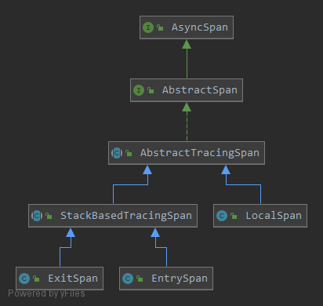

# Trace链路

`Skywalking`中的链路由三个概念组成：

* `Trace`：表示一整条链路，包括跨线程、跨进程的所有Segment的集合
* `Segment`：表示一个JVM进程内一个线程的所有操作的集合
* `Span`：表示具体的某一个操作

三者组成了一个树形的层级结构：

* Trace
    * Segment 1
        * Span 1
        * Span 2
    * Segment 2

# TraceId生成

```java
@RequiredArgsConstructor
@ToString
@EqualsAndHashCode
public abstract class DistributedTraceId {
    @Getter
    private final String id;
}
```

`DistributedTraceId`有两个实现的子类，`PropagatedTraceId`和`NewDistributedTraceId`。

`PropagatedTraceId`构造函数需要传入traceId并赋值:

```java
public class PropagatedTraceId extends DistributedTraceId {
    public PropagatedTraceId(String id) {
        super(id);
    }
}
```

`NewDistributedTraceId`会通过`GlobalIdGenerator`的`generate()`方法生成traceId并赋值：

```java
public class NewDistributedTraceId extends DistributedTraceId {
    public NewDistributedTraceId() {
        super(GlobalIdGenerator.generate());
    }
}
```

`GlobalIdGenerator`的`generate()`方法，该方法用于生成TraceId和SegmentId，代码如下：

```java
public static String generate() {
    return StringUtil.join(
        '.',
        PROCESS_ID,
        String.valueOf(Thread.currentThread().getId()),
        String.valueOf(THREAD_ID_SEQUENCE.get().nextSeq())
    );
}
```

生成的traceId由三部分组成，第一部分表示应用实例的Id，是一个UUID；第二部分表示线程Id；第三部分是一个毫秒级的时间戳+一个当前线程里的序号，该序号的范围是0-9999

第三部分调用`ThreadLocal`中`IDContext`的`nextSeq()`方法生成，代码如下：

```java
private static class IDContext {
    private long lastTimestamp;
    private short threadSeq;

    // Just for considering time-shift-back only.
    private long lastShiftTimestamp;
    private int lastShiftValue;

    private IDContext(long lastTimestamp, short threadSeq) {
        this.lastTimestamp = lastTimestamp;
        this.threadSeq = threadSeq;
    }

    private long nextSeq() {
        return timestamp() * 10000 + nextThreadSeq();
    }

    private long timestamp() {
        long currentTimeMillis = System.currentTimeMillis();

        if (currentTimeMillis < lastTimestamp) {
            // Just for considering time-shift-back by Ops or OS. @hanahmily 's suggestion.
            if (lastShiftTimestamp != currentTimeMillis) {
                lastShiftValue++;
                lastShiftTimestamp = currentTimeMillis;
            }
            return lastShiftValue;
        } else {
            lastTimestamp = currentTimeMillis;
            return lastTimestamp;
        }
    }

    private short nextThreadSeq() {
        if (threadSeq == 10000) {
            threadSeq = 0;
        }
        return threadSeq++;
    }
}
```

# TraceSegment

`TraceSegment`是整个追踪链路中的一个部分，代表当前线程内的所有操作。

```java
/**
 * {@link TraceSegment} is a segment or fragment of the distributed trace. See https://github.com/opentracing/specification/blob/master/specification.md#the-opentracing-data-model
 * A {@link TraceSegment} means the segment, which exists in current {@link Thread}. And the distributed trace is formed
 * by multi {@link TraceSegment}s, because the distributed trace crosses multi-processes, multi-threads. <p>
 */
public class TraceSegment {
    /**
     * The id of this trace segment. Every segment has its unique-global-id.
     */
    private String traceSegmentId;

    /**
     * The refs of parent trace segments, except the primary one. For most RPC call, {@link #ref} contains only one
     * element, but if this segment is a start span of batch process, the segment faces multi parents, at this moment,
     * we only cache the first parent segment reference.
     * <p>
     * This field will not be serialized. Keeping this field is only for quick accessing.
     */
    private TraceSegmentRef ref;

    /**
     * The spans belong to this trace segment. They all have finished. All active spans are hold and controlled by
     * "skywalking-api" module.
     */
    private List<AbstractTracingSpan> spans;

    /**
     * The <code>relatedGlobalTraceId</code> represent the related trace. Most time it related only one
     * element, because only one parent {@link TraceSegment} exists, but, in batch scenario, the num becomes greater
     * than 1, also meaning multi-parents {@link TraceSegment}. But we only related the first parent TraceSegment.
     */
    private DistributedTraceId relatedGlobalTraceId;
```

* `traceSegmentId`：每个Segment都有一个全局唯一的Id
* `ref`：指向当前Segment的Parent Segment的指针
* `spans`：保存Segment中所有的Span
* `relatedGlobalTraceId`：当前Segment所在Trace的Id

`TraceSegmentRef`的作用类似于指针，指向另一个`TraceSegment`。

```java
@Getter
public class TraceSegmentRef {
    private SegmentRefType type;
    private String traceId;
    private String traceSegmentId;
    private int spanId;
    private String parentService;
    private String parentServiceInstance;
    private String parentEndpoint;
    private String addressUsedAtClient;

    public enum SegmentRefType {
        CROSS_PROCESS, CROSS_THREAD
    }
}
```

# Span

`Span`的继承结构如下图所示：



## AsyncSpan

最上层的接口是`AsyncSpan`，一般用于异步插件，代码如下：

```java
/**
 * Span could use these APIs to active and extend its lift cycle across thread.
 * <p>
 * This is typical used in async plugin, especially RPC plugins.
 */
public interface AsyncSpan {
    /**
     * The span finish at current tracing context, but the current span is still alive, until {@link #asyncFinish}
     * called.
     * <p>
     * This method must be called
     * <p>
     * 1. In original thread(tracing context). 2. Current span is active span.
     * <p>
     * During alive, tags, logs and attributes of the span could be changed, in any thread.
     * <p>
     * The execution times of {@link #prepareForAsync} and {@link #asyncFinish()} must match.
     *
     * @return the current span
     */
    AbstractSpan prepareForAsync();

    /**
     * Notify the span, it could be finished.
     * <p>
     * The execution times of {@link #prepareForAsync} and {@link #asyncFinish()} must match.
     *
     * @return the current span
     */
    AbstractSpan asyncFinish();
}
```

## AbstractSpan

`AbstractSpan`继承自`AsyncSpan`，定义了`Span`的骨架，代码如下：

```java
/**
 * The <code>AbstractSpan</code> represents the span's skeleton, which contains all open methods.
 */
public interface AbstractSpan extends AsyncSpan {
    /**
     * Set the component id, which defines in {@link ComponentsDefine}
     *
     * @return the span for chaining.
     */
    AbstractSpan setComponent(Component component);

    AbstractSpan setLayer(SpanLayer layer);

    /**
     * Set a key:value tag on the Span.
     *
     * @return this Span instance, for chaining
     * @deprecated use {@link #tag(AbstractTag, String)} in companion with {@link Tags#ofKey(String)} instead
     */
    @Deprecated
    AbstractSpan tag(String key, String value);

    /**
     *
     */
    AbstractSpan tag(AbstractTag<?> tag, String value);

    /**
     * Record an exception event of the current walltime timestamp.
     *
     * @param t any subclass of {@link Throwable}, which occurs in this span.
     * @return the Span, for chaining
     */
    AbstractSpan log(Throwable t);

    AbstractSpan errorOccurred();

    /**
     * @return true if the actual span is an entry span.
     */
    boolean isEntry();

    /**
     * @return true if the actual span is an exit span.
     */
    boolean isExit();

    /**
     * Record an event at a specific timestamp.
     *
     * @param timestamp The explicit timestamp for the log record.
     * @param event     the events
     * @return the Span, for chaining
     */
    AbstractSpan log(long timestamp, Map<String, ?> event);

    /**
     * Sets the string name for the logical operation this span represents.
     *
     * @return this Span instance, for chaining
     */
    AbstractSpan setOperationName(String operationName);

    /**
     * Start a span.
     *
     * @return this Span instance, for chaining
     */
    AbstractSpan start();

    /**
     * Get the id of span
     *
     * @return id value.
     */
    int getSpanId();

    String getOperationName();

    /**
     * Reference other trace segment.
     *
     * @param ref segment ref
     */
    void ref(TraceSegmentRef ref);

    AbstractSpan start(long startTime);

    AbstractSpan setPeer(String remotePeer);

    /**
     * @return true if the span's owner(tracing context main thread) is been profiled.
     */
    boolean isProfiling();

    /**
     * Should skip analysis in the backend.
     */
    void skipAnalysis();
}
```

`setLayer()`用于指定当前Span表示的操作所在的插件属于哪一种SkyWalking划分的类型，在SpanLayer中定义了五种类型：

```java
public enum SpanLayer {
    DB(1), RPC_FRAMEWORK(2), HTTP(3), MQ(4), CACHE(5);
}
```

## AbstractTracingSpan

抽象类`AbstractTracingSpan`实现了`AbstractSpan`接口，内部属性代码如下：

```java
/**
 * The <code>AbstractTracingSpan</code> represents a group of {@link AbstractSpan} implementations, which belongs a real
 * distributed trace.
 */
public abstract class AbstractTracingSpan implements AbstractSpan {
    /**
     * Span id starts from 0.
     */
    protected int spanId;
    /**
     * Parent span id starts from 0. -1 means no parent span.
     */
    protected int parentSpanId;
    protected List<TagValuePair> tags;
    protected String operationName;
    protected SpanLayer layer;
    /**
     * The span has been tagged in async mode, required async stop to finish.
     */
    protected volatile boolean isInAsyncMode = false;
    /**
     * The flag represents whether the span has been async stopped
     */
    private volatile boolean isAsyncStopped = false;

    /**
     * The context to which the span belongs
     */
    protected final TracingContext owner;

    /**
     * The start time of this Span.
     */
    protected long startTime;
    /**
     * The end time of this Span.
     */
    protected long endTime;
    /**
     * Error has occurred in the scope of span.
     */
    protected boolean errorOccurred = false;

    protected int componentId = 0;

    /**
     * Log is a concept from OpenTracing spec. https://github.com/opentracing/specification/blob/master/specification.md#log-structured-data
     */
    protected List<LogDataEntity> logs;

    /**
     * The refs of parent trace segments, except the primary one. For most RPC call, {@link #refs} contains only one
     * element, but if this segment is a start span of batch process, the segment faces multi parents, at this moment,
     * we use this {@link #refs} to link them.
     */
    protected List<TraceSegmentRef> refs;

    /**
     * Tracing Mode. If true means represents all spans generated in this context should skip analysis.
     */
    protected boolean skipAnalysis;
}
```

`SkyWalking`中`Trace`数据模型的实现如下图：


一个`Trace`由多个`TraceSegment`组成，`TraceSegment`使用`TraceSegmentRef`指向它的上一个`TraceSegment`。每个`TraceSegment`中有多个`Span`，每个`Span`都有`spanId`和`parentSpanId`，`spanId`从0开始，`parentSpanId`指向上一个`span`的Id。一个`TraceSegment`中第一个创建的`Span`叫`EntrySpa`n，调用的本地方法对应`LocalSpan`，离开当前`Segment`对应`ExitSpan`。每个`Span`都有一个`refs`，每个`TraceSegment`的第一个`Span`的`refs`会指向它所在`TraceSegment`的上一个`TraceSegment`。

## StackBasedTracingSpan

`StackBasedTracingSpan`是一个内部具有栈结构的`Span`，它可以启动和关闭多次在一个类似栈的执行流程中

在看`StackBasedTracingSpan`源码之前，我们先来看下`StackBasedTracingSpan`的工作原理。

假设有一个应用部署在`Tomcat`上，使用`SpringMVC`提供一个`getUser()`的Controller方法，`getUser()`方法直接返回不会调用其他的第三方。

在这样一个单体结构中，只会有一个`TraceSegment`，`TraceSegment`中会有一个`EntrySpan`。

请求进来后，走到`Tomcat`，`SkyWalking`的Tomcat插件会尝试创建`EntrySpan`，如果发现自己是这个请求到达后第一个工作的插件就会创建`EntrySpan`，如果不是第一个就会复用之前插件创建的`EntrySpan`。Tomcat插件创建·，并会在Span上记录`tags`、`logs`、`component`、`layer`等信息，代码如下：

```java
public class TomcatInvokeInterceptor implements InstanceMethodsAroundInterceptor {

    @Override
    public void beforeMethod(EnhancedInstance objInst, Method method, Object[] allArguments, Class<?>[] argumentsTypes,
                             MethodInterceptResult result) throws Throwable {
        Request request = (Request) allArguments[0];
        ContextCarrier contextCarrier = new ContextCarrier();

        CarrierItem next = contextCarrier.items();
        while (next.hasNext()) {
            next = next.next();
            next.setHeadValue(request.getHeader(next.getHeadKey()));
        }
        String operationName =  String.join(":", request.getMethod(), request.getRequestURI());
        AbstractSpan span = ContextManager.createEntrySpan(operationName, contextCarrier);
        Tags.URL.set(span, request.getRequestURL().toString());
        Tags.HTTP.METHOD.set(span, request.getMethod());
        span.setComponent(ComponentsDefine.TOMCAT);
        SpanLayer.asHttp(span);

        if (TomcatPluginConfig.Plugin.Tomcat.COLLECT_HTTP_PARAMS) {
            collectHttpParam(request, span);
        }
    }
}
```

请求经过`Tomcat`后交给`SpringMVC`，`SpringMVC`插件也会创建`EntrySpan`，代码如下：

```java
public abstract class AbstractMethodInterceptor implements InstanceMethodsAroundInterceptor {
    @Override
    public void beforeMethod(EnhancedInstance objInst, Method method, Object[] allArguments, Class<?>[] argumentsTypes,
                             MethodInterceptResult result) throws Throwable {

        Boolean forwardRequestFlag = (Boolean) ContextManager.getRuntimeContext().get(FORWARD_REQUEST_FLAG);
        /**
         * Spring MVC plugin do nothing if current request is forward request.
         * Ref: https://github.com/apache/skywalking/pull/1325
         */
        if (forwardRequestFlag != null && forwardRequestFlag) {
            return;
        }

        Object request = ContextManager.getRuntimeContext().get(REQUEST_KEY_IN_RUNTIME_CONTEXT);

        if (request != null) {
            StackDepth stackDepth = (StackDepth) ContextManager.getRuntimeContext().get(CONTROLLER_METHOD_STACK_DEPTH);

            if (stackDepth == null) {
                final ContextCarrier contextCarrier = new ContextCarrier();

                if (IN_SERVLET_CONTAINER && HttpServletRequest.class.isAssignableFrom(request.getClass())) {
                    final HttpServletRequest httpServletRequest = (HttpServletRequest) request;
                    CarrierItem next = contextCarrier.items();
                    while (next.hasNext()) {
                        next = next.next();
                        next.setHeadValue(httpServletRequest.getHeader(next.getHeadKey()));
                    }

                    String operationName = this.buildOperationName(method, httpServletRequest.getMethod(),
                                                                   (EnhanceRequireObjectCache) objInst.getSkyWalkingDynamicField());
                    AbstractSpan span = ContextManager.createEntrySpan(operationName, contextCarrier);
                    Tags.URL.set(span, httpServletRequest.getRequestURL().toString());
                    Tags.HTTP.METHOD.set(span, httpServletRequest.getMethod());
                    span.setComponent(ComponentsDefine.SPRING_MVC_ANNOTATION);
                    SpanLayer.asHttp(span);

                    if (SpringMVCPluginConfig.Plugin.SpringMVC.COLLECT_HTTP_PARAMS) {
                        RequestUtil.collectHttpParam(httpServletRequest, span);
                    }

                    if (!CollectionUtil.isEmpty(SpringMVCPluginConfig.Plugin.Http.INCLUDE_HTTP_HEADERS)) {
                        RequestUtil.collectHttpHeaders(httpServletRequest, span);
                    }
                } else if (ServerHttpRequest.class.isAssignableFrom(request.getClass())) {
                    final ServerHttpRequest serverHttpRequest = (ServerHttpRequest) request;
                    CarrierItem next = contextCarrier.items();
                    while (next.hasNext()) {
                        next = next.next();
                        next.setHeadValue(serverHttpRequest.getHeaders().getFirst(next.getHeadKey()));
                    }

                    String operationName = this.buildOperationName(method, serverHttpRequest.getMethodValue(),
                                                                   (EnhanceRequireObjectCache) objInst.getSkyWalkingDynamicField());
                    AbstractSpan span = ContextManager.createEntrySpan(operationName, contextCarrier);
                    Tags.URL.set(span, serverHttpRequest.getURI().toString());
                    Tags.HTTP.METHOD.set(span, serverHttpRequest.getMethodValue());
                    span.setComponent(ComponentsDefine.SPRING_MVC_ANNOTATION);
                    SpanLayer.asHttp(span);

                    if (SpringMVCPluginConfig.Plugin.SpringMVC.COLLECT_HTTP_PARAMS) {
                        RequestUtil.collectHttpParam(serverHttpRequest, span);
                    }

                    if (!CollectionUtil.isEmpty(SpringMVCPluginConfig.Plugin.Http.INCLUDE_HTTP_HEADERS)) {
                        RequestUtil.collectHttpHeaders(serverHttpRequest, span);
                    }
                } else {
                    throw new IllegalStateException("this line should not be reached");
                }

                stackDepth = new StackDepth();
                ContextManager.getRuntimeContext().put(CONTROLLER_METHOD_STACK_DEPTH, stackDepth);
            } else {
                AbstractSpan span = ContextManager.createLocalSpan(buildOperationName(objInst, method));
                span.setComponent(ComponentsDefine.SPRING_MVC_ANNOTATION);
            }

            stackDepth.increment();
        }
    }
}
```

`Tomcat`已经创建了`EntrySpan`，`SpringMVC`就不能再创建`EntrySpan`了，`SpringMVC`会复用`Tomcat`创建的`EntrySpan`。`Tomcat`已经在`Span`上记录`tags`、`logs`、`component`、`layer`等信息，`SpringMVC`这里会覆盖掉之前`Tomcat`在`Span`上记录的信息。

`EntrySpan`就是使用`StackBasedTracingSpan`这种基于栈的`Span`来实现的，`EntrySpan`中有两个属性：当前栈深`stackDepth`和当前最大栈深`currentMaxDepth`。

1. `Tomcat`创建`EntrySpan`，`EntrySpan`中当前栈深=1，当前最大栈深=1
2. `SpringMVC`复用`Tomcat`创建的`EntrySpan`，会把当前栈深和当前最大栈深都+1，此时当前栈深=2，当前最大栈深=2
3. 当`getUser()`方法执行完后，首先返回到`SpringMVC`，会把当前栈深-1，当前最大栈深是只增不减的，此时当前栈深=1，当前最大栈深=2
4. 当返回到`Tomcat`时，当前栈深-1，此时当前栈深=0，当前最大栈深=2，当前栈深=0时，就代表EntrySpan出栈了

如何判断当前`EntrySpan`是复用前面的呢？只需要判断`currentMaxDepth`不等于1就是复用前面的`EntrySpan`，如果等于1就是当前插件创建的`EntrySpan`。记录`Span`信息的时候都是请求进来`EntrySpan`入栈的流程，只要stackDepth=currentMaxDepth时就是请求进来的流程，所以只有stackDepth=currentMaxDepth时才允许记录Span的信息

`EntrySpan`有如下几个特性：

* 在一个`TraceSegment`里面只能存在一个`EntrySpan`
* 后面的插件复用前面插件创建的`EntrySpan`时会覆盖掉前面插件设置的`Span`信息
* 记录的信息永远是最靠近服务提供侧的信息

`StackBasedTracingSpan`中包含`stackDepth`属性，代码如下：

```java
public abstract class StackBasedTracingSpan extends AbstractTracingSpan {
    protected int stackDepth;

    @Override
    public boolean finish(TraceSegment owner) {
        if (--stackDepth == 0) {
            return super.finish(owner);
        } else {
            return false;
        }
    }
}
```

`finish()`方法中，当`stackDepth`等于0时，栈就空了，就代表`EntrySpan`结束了。

`EntrySpan`中包含`currentMaxDepth`属性，代码如下：

```java
/**
 * The <code>EntrySpan</code> represents a service provider point, such as Tomcat server entrance.
 * <p>
 * It is a start point of {@link TraceSegment}, even in a complex application, there maybe have multi-layer entry point,
 * the <code>EntrySpan</code> only represents the first one.
 * <p>
 * But with the last <code>EntrySpan</code>'s tags and logs, which have more details about a service provider.
 * <p>
 * Such as: Tomcat Embed - Dubbox The <code>EntrySpan</code> represents the Dubbox span.
 */
public class EntrySpan extends StackBasedTracingSpan {

    private int currentMaxDepth;

    public EntrySpan(int spanId, int parentSpanId, String operationName, TracingContext owner) {
        super(spanId, parentSpanId, operationName, owner);
        this.currentMaxDepth = 0;
    }

    /**
     * Set the {@link #startTime}, when the first start, which means the first service provided.
     */
    @Override
    public EntrySpan start() {
        if ((currentMaxDepth = ++stackDepth) == 1) {
            super.start();
        }
        clearWhenRestart();
        return this;
    }

    @Override
    public EntrySpan tag(String key, String value) {
        if (stackDepth == currentMaxDepth || isInAsyncMode) {
            super.tag(key, value);
        }
        return this;
    }

    @Override
    public AbstractTracingSpan setLayer(SpanLayer layer) {
        if (stackDepth == currentMaxDepth || isInAsyncMode) {
            return super.setLayer(layer);
        } else {
            return this;
        }
    }

    @Override
    public AbstractTracingSpan setComponent(Component component) {
        if (stackDepth == currentMaxDepth || isInAsyncMode) {
            return super.setComponent(component);
        } else {
            return this;
        }
    }

    @Override
    public AbstractTracingSpan setOperationName(String operationName) {
        if (stackDepth == currentMaxDepth || isInAsyncMode) {
            return super.setOperationName(operationName);
        } else {
            return this;
        }
    }

    @Override
    public EntrySpan log(Throwable t) {
        super.log(t);
        return this;
    }

    @Override
    public boolean isEntry() {
        return true;
    }

    @Override
    public boolean isExit() {
        return false;
    }

    private void clearWhenRestart() {
        this.componentId = Constants.NULL_VALUE;
        this.layer = null;
        this.logs = null;
        this.tags = null;
    }
}
```