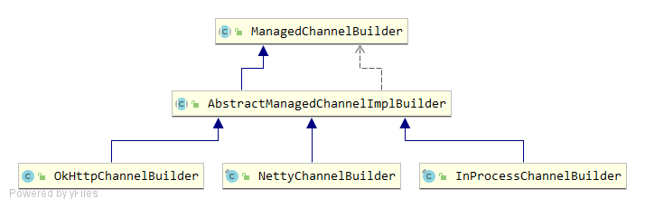

# GRPCChannelManager

`Skywalking Agent`会定期将收集到的数据发送到后端的`OAP`集群，`GRPCChannelManager`就负责维护`Agent`与`OAP`集群之间通信的网络连接。

`Agent`与`OAP`之间是采用`gRPC`进行通信的，在`gRPC`中有两个重要的组件：

* `ManagedChannel`：是`gRPC`客户端的核心类之一，它表示一个通信通道，底层持有一个`TCP`连接，并负责维护此连接的活性。在`RPC`调用的任何时机，如果检测到底层连接处于关闭状态，它会重新尝试建立连接。通常情况下，我们不需要在`RPC`调用结束后关闭连接，该连接可以一直重用，直到应用程序关闭。
* `ManagedChannelBuilder`：负责创建客户端Channel，常用的`ManagedChannelBuilder`有三种，`NettyChannelBuilder`、`OkHttpChannelBuilder`、`InProcessChannelBuilder`，`Skywalking Agent`中使用的是`NettyChannelBuilder`，底层是基于`Netty`实现的。



`Skywaling`在`ManagedChannel`的基础上封装了`GRPCChannel`，可以添加一些装饰器，目前有`AgentIDDecorator`和`AuthenticationDecorator`两种。

`GRPCChannelManager`中维护了一个`GRPCChannel`连接以及注册的`Listener`监听器，主要的属性有：

```java
private volatile GRPCChannel managedChannel = null;
private volatile ScheduledFuture<?> connectCheckFuture;
private volatile boolean reconnect = true;
private final Random random = new Random();
private final List<GRPCChannelListener> listeners = Collections.synchronizedList(new LinkedList<>());
private volatile List<String> grpcServers;
private volatile int selectedIdx = -1;
private volatile int reconnectCount = 0;
```

`GRPCChannelManager`除了实现了`BootService`接口外，还实现了`Runnable`接口。`GRPCChannelManager`启动时会创建一个线程池定时调度执行`run`方法，定时时间可在参数`Config.Collector.GRPC_CHANNEL_CHECK_INTERVAL`中设置。

```java
@Override
public void boot() {
    if (Config.Collector.BACKEND_SERVICE.trim().length() == 0) {
        LOGGER.error("Collector server addresses are not set.");
        LOGGER.error("Agent will not uplink any data.");
        return;
    }
    grpcServers = Arrays.asList(Config.Collector.BACKEND_SERVICE.split(","));
    connectCheckFuture = Executors.newSingleThreadScheduledExecutor(
        new DefaultNamedThreadFactory("GRPCChannelManager")
    ).scheduleAtFixedRate(
        new RunnableWithExceptionProtection(
            this,
            t -> LOGGER.error("unexpected exception.", t)
        ), 0, Config.Collector.GRPC_CHANNEL_CHECK_INTERVAL, TimeUnit.SECONDS
    );
}
```

`run`方法被线程池定时调度执行，其中主要的逻辑有3点：

1. 通过DNS解析来保证后端`OAP`服务地址的可用性。`Config.Collector.IS_RESOLVE_DNS_PERIODICALLY`参数定义该功能是否启用，默认值是`false`，即不启用。

```java
if (IS_RESOLVE_DNS_PERIODICALLY && reconnect) {
    grpcServers = Arrays.stream(Config.Collector.BACKEND_SERVICE.split(","))
            .filter(StringUtil::isNotBlank)
            .map(eachBackendService -> eachBackendService.split(":"))
            .filter(domainPortPairs -> {
                if (domainPortPairs.length < 2) {
                    LOGGER.debug("Service address [{}] format error. The expected format is IP:port", domainPortPairs[0]);
                    return false;
                }
                return true;
            })
            .flatMap(domainPortPairs -> {
                try {
                    return Arrays.stream(InetAddress.getAllByName(domainPortPairs[0]))
                            .map(InetAddress::getHostAddress)
                            .map(ip -> String.format("%s:%s", ip, domainPortPairs[1]));
                } catch (Throwable t) {
                    LOGGER.error(t, "Failed to resolve {} of backend service.", domainPortPairs[0]);
                }
                return Stream.empty();
            })
            .distinct()
            .collect(Collectors.toList());
}
```

2. 建立`gRPC`连接并保持该连接的活性。`reconnect`表示是否进行连接，默认是`true`，当连接建立起来后置为`false`。创建连接时会随机从`Config.Collector.BACKEND_SERVICE`参数配置的后端服务地址中选择一个，创建一个`GRPCChannel`实例，创建过程使用了`Builder`模式，并添加了`StandardChannelBuilder`、`TLSChannelBuilder`两个`ChannelBuilder`实例，以及`AgentIDDecorator`和`AuthenticationDecorator`两个`ChannelDecorator`实例。

```java
if (reconnect) {
    if (grpcServers.size() > 0) {
        String server = "";
        try {
            int index = Math.abs(random.nextInt()) % grpcServers.size();
            if (index != selectedIdx) {
                selectedIdx = index;

                server = grpcServers.get(index);
                String[] ipAndPort = server.split(":");

                if (managedChannel != null) {
                    managedChannel.shutdownNow();
                }

                managedChannel = GRPCChannel.newBuilder(ipAndPort[0], Integer.parseInt(ipAndPort[1]))
                                            .addManagedChannelBuilder(new StandardChannelBuilder())
                                            .addManagedChannelBuilder(new TLSChannelBuilder())
                                            .addChannelDecorator(new AgentIDDecorator())
                                            .addChannelDecorator(new AuthenticationDecorator())
                                            .build();
                reconnectCount = 0;
                reconnect = false;
                notify(GRPCChannelStatus.CONNECTED);
            } else if (managedChannel.isConnected(++reconnectCount > Config.Agent.FORCE_RECONNECTION_PERIOD)) {
                // Reconnect to the same server is automatically done by GRPC,
                // therefore we are responsible to check the connectivity and
                // set the state and notify listeners
                reconnectCount = 0;
                reconnect = false;
                notify(GRPCChannelStatus.CONNECTED);
            }

            return;
        } catch (Throwable t) {
            LOGGER.error(t, "Create channel to {} fail.", server);
        }
    }
}
```

`gRPC`会自动进行重连，因此如果随机选择到的后端服务就是上次连接失败的那个，直接通过`managedChannel.isConnected`方法判断是否已经重连成功，如果重连成功那么将`reconnect`置为`false`。

当网络出现异常时会将`reconnect`重置为`true`，待下次定时任务执行时进行重连。

```java
public void reportError(Throwable throwable) {
    if (isNetworkError(throwable)) {
        reconnect = true;
        notify(GRPCChannelStatus.DISCONNECT);
    }
}
```

3. 当网络状态发生变化时通知已注册的`listener`。

```java
private void notify(GRPCChannelStatus status) {
    for (GRPCChannelListener listener : listeners) {
        try {
            listener.statusChanged(status);
        } catch (Throwable t) {
            LOGGER.error(t, "Fail to notify {} about channel connected.", listener.getClass().getName());
        }
    }
}
```

通过以上机制，`GRPCChannelManager`实现了`gRPC`连接的建立和保活。

# ServiceManagementClient

`ServiceManagementClient`也是一个`BootService`，同时还实现了`GRPCChannelListener`、`Runnable`接口。

在`GRPCChannelListener`的回调方法`statusChanged`中，如果发现重连，会重新创建一个`ManagementServiceBlockingStub`的实例用于和`OAP`通信。

```java
@Override
public void statusChanged(GRPCChannelStatus status) {
    if (GRPCChannelStatus.CONNECTED.equals(status)) {
        Channel channel = ServiceManager.INSTANCE.findService(GRPCChannelManager.class).getChannel();
        managementServiceBlockingStub = ManagementServiceGrpc.newBlockingStub(channel);
    } else {
        managementServiceBlockingStub = null;
    }
    this.status = status;
}
```

在`prepare`阶段，`ServiceManagementClient`会将自己作为`GRPCChannelListener`注册到`GRPCChannelManager`中。

```java
@Override
public void prepare() {
    ServiceManager.INSTANCE.findService(GRPCChannelManager.class).addChannelListener(this);

    SERVICE_INSTANCE_PROPERTIES = InstanceJsonPropertiesUtil.parseProperties();
}
```

在`boot`阶段，`ServiceManagementClient`会启动一个定时调度的线程池用于执行心跳任务，定时时间在`Config.Collector.HEARTBEAT_PERIOD`参数中配置，单位是秒，默认值30。

```java
@Override
public void boot() {
    heartbeatFuture = Executors.newSingleThreadScheduledExecutor(
        new DefaultNamedThreadFactory("ServiceManagementClient")
    ).scheduleAtFixedRate(
        new RunnableWithExceptionProtection(
            this,
            t -> LOGGER.error("unexpected exception.", t)
        ), 0, Config.Collector.HEARTBEAT_PERIOD,
        TimeUnit.SECONDS
    );
}
```

定时任务执行时实际调用的就是`ServiceManagementClient`的`run`方法，只不过被`RunnableWithExceptionProtection`又包装了一层，增加了异常时的处理。定时任务的逻辑主要包括信息上报以及心跳消息。

`ServiceManagementClient`每间隔若干次（`Config.Collector.PROPERTIES_REPORT_PERIOD_FACTOR`配置，默认10，由于定时任务的默认间隔是30秒，因此默认每300秒即5分钟上报一次信息）就就行信息上报，主要包括操作系统信息和JVM信息，否则发送心跳消息。

```java
@Override
public void run() {
    LOGGER.debug("ServiceManagementClient running, status:{}.", status);

    if (GRPCChannelStatus.CONNECTED.equals(status)) {
        try {
            if (managementServiceBlockingStub != null) {
                if (Math.abs(
                    sendPropertiesCounter.getAndAdd(1)) % Config.Collector.PROPERTIES_REPORT_PERIOD_FACTOR == 0) {

                    managementServiceBlockingStub
                        .withDeadlineAfter(GRPC_UPSTREAM_TIMEOUT, TimeUnit.SECONDS)
                        .reportInstanceProperties(InstanceProperties.newBuilder()
                                                                    .setService(Config.Agent.SERVICE_NAME)
                                                                    .setServiceInstance(Config.Agent.INSTANCE_NAME)
                                                                    .addAllProperties(OSUtil.buildOSInfo(
                                                                        Config.OsInfo.IPV4_LIST_SIZE))
                                                                    .addAllProperties(SERVICE_INSTANCE_PROPERTIES)
                                                                    .addAllProperties(
                                                                        LoadedLibraryCollector.buildJVMInfo())
                                                                    .build());
                } else {
                    final Commands commands = managementServiceBlockingStub.withDeadlineAfter(
                        GRPC_UPSTREAM_TIMEOUT, TimeUnit.SECONDS
                    ).keepAlive(InstancePingPkg.newBuilder()
                                                .setService(Config.Agent.SERVICE_NAME)
                                                .setServiceInstance(Config.Agent.INSTANCE_NAME)
                                                .build());

                    ServiceManager.INSTANCE.findService(CommandService.class).receiveCommand(commands);
                }
            }
        } catch (Throwable t) {
            LOGGER.error(t, "ServiceManagementClient execute fail.");
            ServiceManager.INSTANCE.findService(GRPCChannelManager.class).reportError(t);
        }
    }
}
```

# CommandService

`CommandService#receiveCommand`执行`OAP`下发的命令，包括两类：

* ProfileTaskCommand：在SkyWalking UI性能剖析功能中，新建任务，会下发给Agent性能追踪任务
* ConfigurationDiscoveryCommand：当前版本SkyWalking Agent支持运行时动态调整配置

`CommandService`同样也是一个`BootService`，并实现了`Runnable`接口，内部维护了一个`Command`队列以及一个序列号缓存。

在`boot`方法中会向线程池提交一个执行`Command`的任务，实际会调用到`CommandService`中的`run`方法。在`run`方法中会不断从`commands`队列中取出命令并执行，如果`commands`队列为空，`take`方法会被阻塞；如果该命令的序列号已在序列号缓存中，表示已经执行过则会直接忽略；否则交给`CommandExecutorService`完成命令的实际执行。

```java
@Override
public void run() {
    final CommandExecutorService commandExecutorService = ServiceManager.INSTANCE.findService(CommandExecutorService.class);

    while (isRunning) {
        try {
            BaseCommand command = commands.take();

            if (isCommandExecuted(command)) {
                continue;
            }

            commandExecutorService.execute(command);
            serialNumberCache.add(command.getSerialNumber());
        } catch (CommandExecutionException e) {
            LOGGER.error(e, "Failed to execute command[{}].", e.command().getCommand());
        } catch (Throwable e) {
            LOGGER.error(e, "There is unexpected exception");
        }
    }
}
```

`CommandSerialNumberCache`维护了一个最近执行命令的缓存，内部使用一个`LinkedBlockingDeque`记录最近执行命令的序列号。队列的默认最大长度是64，当向缓存添加命令时，如果超过了队列最大长度，会从头部将最早的命令出队，避免队列长度的不停增长。

```java
public class CommandSerialNumberCache {
    private static final int DEFAULT_MAX_CAPACITY = 64;
    private final Deque<String> queue;
    private final int maxCapacity;

    public CommandSerialNumberCache() {
        this(DEFAULT_MAX_CAPACITY);
    }

    public CommandSerialNumberCache(int maxCapacity) {
        queue = new LinkedBlockingDeque<String>(maxCapacity);
        this.maxCapacity = maxCapacity;
    }

    public void add(String number) {
        if (queue.size() >= maxCapacity) {
            queue.pollFirst();
        }

        queue.add(number);
    }

    public boolean contain(String command) {
        return queue.contains(command);
    }
}
```

# CommandExecutorService

`CommandExecutorService`依然是一个`BootService`，实现了`CommandExecutor`接口，`CommandExecutor`接口仅有一个`execute`方法用于命令的执行。

`CommandExecutorService`在`prepare`方法中创建了一个`commandExecutorMap`，并添加了两个`CommandExecutor`的实例，根据命令种类的不同交由不同的`CommandExecutor`执行。

```java
@Override
public void prepare() throws Throwable {
    commandExecutorMap = new HashMap<String, CommandExecutor>();

    // Profile task executor
    commandExecutorMap.put(ProfileTaskCommand.NAME, new ProfileTaskCommandExecutor());

    //Get ConfigurationDiscoveryCommand executor.
    commandExecutorMap.put(ConfigurationDiscoveryCommand.NAME, new ConfigurationDiscoveryCommandExecutor());
}
```

命令执行时根据类型从`commandExecutorMap`找到实际的`CommandExecutor`才真正执行。

```java
@Override
public void execute(final BaseCommand command) throws CommandExecutionException {
    executorForCommand(command).execute(command);
}

private CommandExecutor executorForCommand(final BaseCommand command) {
    final CommandExecutor executor = commandExecutorMap.get(command.getCommand());
    if (executor != null) {
        return executor;
    }
    return NoopCommandExecutor.INSTANCE;
}
```

`NoopCommandExecutor`是一个不含逻辑的空`CommandExecutor`，仅用于未知命令类型时的兼容处理。`ProfileTaskCommandExecutor`用于执行`ProfileTaskCommand`。`ConfigurationDiscoveryCommandExecutor`用于执行`ConfigurationDiscoveryCommand`。

# ConfigurationDiscoveryService

`ConfigurationDiscoveryService`实现了`BootService`和`GRPCChannelListener`接口。

```java
public class ConfigurationDiscoveryService implements BootService, GRPCChannelListener {

    private final Register register = new Register();
    ......
}
```

`ConfigurationDiscoveryService`内部有一个`Register`内部类，实际上是一个`Map`，value类型是内部类`WatcherHolder`，`WatcherHolder`中包含了`AgentConfigChangeWatcher`属性。

```java
public static class Register {
        private final Map<String, List<WatcherHolder>> register = new HashMap<>();
}

private static class WatcherHolder {
    private final AgentConfigChangeWatcher watcher;
    private final String key;
}
```

通过`registerAgentConfigChangeWatcher()`方法注册`watcher`，注册时会将`watcher`包装为一个`WatcherHolder`对象加入`register`中。

```java
public synchronized void registerAgentConfigChangeWatcher(AgentConfigChangeWatcher watcher) {
    WatcherHolder holder = new WatcherHolder(watcher);
    if (register.containsKey(holder.getKey())) {
        List<WatcherHolder> watcherHolderList = register.get(holder.getKey());
        for (WatcherHolder watcherHolder : watcherHolderList) {
            if (watcherHolder.getWatcher().getClass().equals(watcher.getClass())) {
                LOGGER.debug("Duplicate register, watcher={}", watcher);
                return;
            }
        }
    }
    register.put(holder.getKey(), holder);
}
```

`AgentConfigChangeWatcher`用于监听`SkyWalking Agent`的某项配置的值的变化，主要的实现包括：`IgnoreSuffixPatternsWatcher`、`SamplingRateWatcher`、`SpanLimitWatcher`、 `TraceIgnorePatternWatcher`、`TraceSqlParametersWatcher`，具体后面再讲。

`ConfigurationDiscoveryService`启动后有一个后台线程定时调用`getAgentDynamicConfig`方法，通过`RPC`请求获取动态配置：

```java
private void getAgentDynamicConfig() {
    if (GRPCChannelStatus.CONNECTED.equals(status)) {
        try {
            ConfigurationSyncRequest.Builder builder = ConfigurationSyncRequest.newBuilder();
            builder.setService(Config.Agent.SERVICE_NAME);

            // Some plugin will register watcher later.
            final int size = register.keys().size();
            if (lastRegisterWatcherSize != size) {
                // reset uuid, avoid the same uuid causing the configuration not to be updated.
                uuid = null;
                lastRegisterWatcherSize = size;
            }

            if (null != uuid) {
                builder.setUuid(uuid);
            }

            if (configurationDiscoveryServiceBlockingStub != null) {
                final Commands commands = configurationDiscoveryServiceBlockingStub.withDeadlineAfter(
                    GRPC_UPSTREAM_TIMEOUT, TimeUnit.SECONDS
                ).fetchConfigurations(builder.build());
                ServiceManager.INSTANCE.findService(CommandService.class).receiveCommand(commands);
            }
        } catch (Throwable t) {
            LOGGER.error(t, "ConfigurationDiscoveryService execute fail.");
            ServiceManager.INSTANCE.findService(GRPCChannelManager.class).reportError(t);
        }
    }
}
```

方法处理逻辑如下：

1. 因为有些插件会延迟注册watcher，当watcher的数量发生了变动，代表有新的配置项需要监听，需要重置uuid，避免同样的uuid导致配置信息没有被更新。
2. 调用`ConfigurationDiscoveryServiceBlockingStub`的`fetchConfigurations()`方法拉取配置，调用CommandService的`receiveCommand()`将命令添加到待处理命令列表，该方法拿到的command序列化后为ConfigurationDiscoveryCommand类型，走执行command中讲的流程，最终由`ConfigurationDiscoveryService`的`handleConfigurationDiscoveryCommand()`来处理配置变更的命令

`handleConfigurationDiscoveryCommand()`方法的主要逻辑是查找出配置的变更项，并触发`Watcher`通知：

```java
public void handleConfigurationDiscoveryCommand(ConfigurationDiscoveryCommand configurationDiscoveryCommand) {
    final String responseUuid = configurationDiscoveryCommand.getUuid();

    if (responseUuid != null && Objects.equals(this.uuid, responseUuid)) {
        return;
    }

    List<KeyStringValuePair> config = readConfig(configurationDiscoveryCommand);

    config.forEach(property -> {
        String propertyKey = property.getKey();
        List<WatcherHolder> holderList = register.get(propertyKey);
        for (WatcherHolder holder : holderList) {
            if (holder != null) {
                AgentConfigChangeWatcher watcher = holder.getWatcher();
                String newPropertyValue = property.getValue();
                if (StringUtil.isBlank(newPropertyValue)) {
                    if (watcher.value() != null) {
                        // Notify watcher, the new value is null with delete event type.
                        watcher.notify(
                                new AgentConfigChangeWatcher.ConfigChangeEvent(
                                        null, AgentConfigChangeWatcher.EventType.DELETE
                                ));
                    } else {
                        // Don't need to notify, stay in null.
                    }
                } else {
                    if (!newPropertyValue.equals(watcher.value())) {
                        watcher.notify(new AgentConfigChangeWatcher.ConfigChangeEvent(
                                newPropertyValue, AgentConfigChangeWatcher.EventType.MODIFY
                        ));
                    } else {
                        // Don't need to notify, stay in the same config value.
                    }
                }
            } else {
                LOGGER.warn("Config {} from OAP, doesn't match any watcher, ignore.", propertyKey);
            }
        }
    });
    this.uuid = responseUuid;

    LOGGER.trace("Current configurations after the sync, configurations:{}", register.toString());
}
```

# SamplingService

`SamplingService`是来控制是否要采样该链路。每条链路都是被追踪到的，但是考虑到序列化/反序列化的CPU消耗以及网络带宽，如果开启采样，`SkyWalking Agent`并不会把所有的链路都发送给`OAP`。默认采样是开启的，可以通过修改`agent.config`中的`agent.sample_n_per_3_secs`配置项控制每3秒最多采样多少条链路

`boot()`方法中创建了一个`SamplingRateWatcher`并向`ConfigurationDiscoveryService`注册该`Watcher`。

```java
@Override
public void boot() {
    samplingRateWatcher = new SamplingRateWatcher("agent.sample_n_per_3_secs", this);
    ServiceManager.INSTANCE.findService(ConfigurationDiscoveryService.class)
                            .registerAgentConfigChangeWatcher(samplingRateWatcher);

    handleSamplingRateChanged();
}
```

`SamplingRateWatcher`监听的是`agent.sample_n_per_3_secs`配置的变更，如果该配置发生了变化，会调用`notify`方法，`SamplingRateWatcher`修改配置后，再调用`SamplingService`的`handleSamplingRateChanged()`方法，通知每3秒能够采集的最大链路数的配置变更。

```java
public void notify(final ConfigChangeEvent value) {
    if (EventType.DELETE.equals(value.getEventType())) {
        activeSetting(String.valueOf(getDefaultValue()));
    } else {
        activeSetting(value.getNewValue());
    }
}

private void activeSetting(String config) {
    if (LOGGER.isDebugEnable()) {
        LOGGER.debug("Updating using new static config: {}", config);
    }
    try {
        this.samplingRate.set(Integer.parseInt(config));

        /*
            * We need to notify samplingService the samplingRate changed.
            */
        samplingService.handleSamplingRateChanged();
    } catch (NumberFormatException ex) {
        LOGGER.error(ex, "Cannot load {} from: {}", getPropertyKey(), config);
    }
}
```

`handleSamplingRateChanged()`方法中判断如果开启采样，初始化定时任务，每3秒重置一次`samplingFactorHolder`，`samplingFactorHolder`是用于累加3秒内已经采样的次数：

```java
public void handleSamplingRateChanged() {
    if (samplingRateWatcher.getSamplingRate() > 0) {
        if (!on) {
            on = true;
            this.resetSamplingFactor();
            ScheduledExecutorService service = Executors.newSingleThreadScheduledExecutor(
                new DefaultNamedThreadFactory("SamplingService"));
            scheduledFuture = service.scheduleAtFixedRate(new RunnableWithExceptionProtection(
                this::resetSamplingFactor, t -> LOGGER.error("unexpected exception.", t)), 0, 3, TimeUnit.SECONDS);
            LOGGER.debug(
                "Agent sampling mechanism started. Sample {} traces in 3 seconds.",
                samplingRateWatcher.getSamplingRate()
            );
        }
    } else {
        if (on) {
            if (scheduledFuture != null) {
                scheduledFuture.cancel(true);
            }
            on = false;
        }
    }
}

private void resetSamplingFactor() {
    samplingFactorHolder = new AtomicInteger(0);
}
```

每一条链路是否要采样取决于`SamplingService`的`trySampling()`方法的返回，如果返回值为true，则该链路会被采样，trySampling()方法代码如下：

```java
public boolean trySampling(String operationName) {
    if (on) {
        int factor = samplingFactorHolder.get();
        if (factor < samplingRateWatcher.getSamplingRate()) {
            return samplingFactorHolder.compareAndSet(factor, factor + 1);
        } else {
            return false;
        }
    }
    return true;
}
```

`forceSampled()`方法强制进行采样：

```java
public void forceSampled() {
    if (on) {
        samplingFactorHolder.incrementAndGet();
    }
}
```

# JVMService

`JVMService`负责收集JVM的CPU、内存、GC、线程、类等信息，然后将收集到的信息通过GRPCChannelManager提供的网络连接发送给OAP。

`prepare()`方法中初始化JVM信息的发送工具，`boot()`方法中初始化收集JVM信息的定时任务`collectMetricFuture`和发送JVM信息的定时任务`sendMetricFuture`。

`collectMetricFuture`实际上执行的是JVMService的`run()`方法，`sendMetricFuture`实际上执行的是`JVMMetricsSender的run()`方法。

```java
public class JVMService implements BootService, Runnable {
    private static final ILog LOGGER = LogManager.getLogger(JVMService.class);
    private volatile ScheduledFuture<?> collectMetricFuture;
    private volatile ScheduledFuture<?> sendMetricFuture;
    private JVMMetricsSender sender;
    private volatile double cpuUsagePercent;

    @Override
    public void prepare() throws Throwable {
        sender = ServiceManager.INSTANCE.findService(JVMMetricsSender.class);
    }

    @Override
    public void boot() throws Throwable {
        collectMetricFuture = Executors.newSingleThreadScheduledExecutor(
            new DefaultNamedThreadFactory("JVMService-produce"))
                                       .scheduleAtFixedRate(new RunnableWithExceptionProtection(
                                           this,
                                           new RunnableWithExceptionProtection.CallbackWhenException() {
                                               @Override
                                               public void handle(Throwable t) {
                                                   LOGGER.error("JVMService produces metrics failure.", t);
                                               }
                                           }
                                       ), 0, 1, TimeUnit.SECONDS);
        sendMetricFuture = Executors.newSingleThreadScheduledExecutor(
            new DefaultNamedThreadFactory("JVMService-consume"))
                                    .scheduleAtFixedRate(new RunnableWithExceptionProtection(
                                        sender,
                                        new RunnableWithExceptionProtection.CallbackWhenException() {
                                            @Override
                                            public void handle(Throwable t) {
                                                LOGGER.error("JVMService consumes and upload failure.", t);
                                            }
                                        }
                                    ), 0, 1, TimeUnit.SECONDS);
    }
}
```

`run()`方法就是构建JVM信息交给`JVMMetricsSender`，后续由`JVMMetricsSender`负责发送给`OAP`。

```java
@Override
    public void run() {
        long currentTimeMillis = System.currentTimeMillis();
        try {
            JVMMetric.Builder jvmBuilder = JVMMetric.newBuilder();
            jvmBuilder.setTime(currentTimeMillis);
            jvmBuilder.setCpu(CPUProvider.INSTANCE.getCpuMetric());
            jvmBuilder.addAllMemory(MemoryProvider.INSTANCE.getMemoryMetricList());
            jvmBuilder.addAllMemoryPool(MemoryPoolProvider.INSTANCE.getMemoryPoolMetricsList());
            jvmBuilder.addAllGc(GCProvider.INSTANCE.getGCList());
            jvmBuilder.setThread(ThreadProvider.INSTANCE.getThreadMetrics());
            jvmBuilder.setClazz(ClassProvider.INSTANCE.getClassMetrics());

            JVMMetric jvmMetric = jvmBuilder.build();
            sender.offer(jvmMetric);

            // refresh cpu usage percent
            cpuUsagePercent = jvmMetric.getCpu().getUsagePercent();
        } catch (Exception e) {
            LOGGER.error(e, "Collect JVM info fail.");
        }
    }
```

`JVMMetricsSender`中维护了一个阻塞队列，长度由参数`Config.Jvm.BUFFER_SIZE`控制，默认长度是600。

```java
public class JVMMetricsSender implements BootService, Runnable, GRPCChannelListener {
    private static final ILog LOGGER = LogManager.getLogger(JVMMetricsSender.class);

    private volatile GRPCChannelStatus status = GRPCChannelStatus.DISCONNECT;
    private volatile JVMMetricReportServiceGrpc.JVMMetricReportServiceBlockingStub stub = null;

    private LinkedBlockingQueue<JVMMetric> queue;

    @Override
    public void prepare() {
        queue = new LinkedBlockingQueue<>(Config.Jvm.BUFFER_SIZE);
        ServiceManager.INSTANCE.findService(GRPCChannelManager.class).addChannelListener(this);
    }
}
```

发送的逻辑在`run()`方法中，通过`gRPC`将队列中的内容发送出去：

```java
@Override
public void run() {
    if (status == GRPCChannelStatus.CONNECTED) {
        try {
            JVMMetricCollection.Builder builder = JVMMetricCollection.newBuilder();
            LinkedList<JVMMetric> buffer = new LinkedList<>();
            queue.drainTo(buffer);
            if (buffer.size() > 0) {
                builder.addAllMetrics(buffer);
                builder.setService(Config.Agent.SERVICE_NAME);
                builder.setServiceInstance(Config.Agent.INSTANCE_NAME);
                Commands commands = stub.withDeadlineAfter(GRPC_UPSTREAM_TIMEOUT, TimeUnit.SECONDS)
                                        .collect(builder.build());
                ServiceManager.INSTANCE.findService(CommandService.class).receiveCommand(commands);
            }
        } catch (Throwable t) {
            LOGGER.error(t, "send JVM metrics to Collector fail.");
            ServiceManager.INSTANCE.findService(GRPCChannelManager.class).reportError(t);
        }
    }
}
```

# KafkaXxxService

SkyWalking Agent上报数据有两种模式：

* 使用`gRPC`直连`OAP`上报数据
* `Agent`发送数据到`Kafka`，`OAP`从`Kafka`中消费数据

如果使用发送`Kafka`的模式，`Agent`和`OAP`依然存在GRPC直连，只是大部分的采集数据上报都改为发送`Kafka`的模式

`KafkaXxxService`就是对应服务的`Kafka`实现，例如：`GRPCChannelManager`是负责`Agent`到`OAP`的网络连接，对应`KafkaProducerManager`是负责`Agent`到`OAP`的`Kafka`的连接；`KafkaJVMMetricsSender`负责`JVM`信息的发送对应`gRPC`的`JVMMetricsSender`；`KafkaServiceManagementServiceClient`负责`Agent Client`信息的上报对应`GRPC`的`ServiceManagementClient`

# StatusCheckService

`StatusCheckService`是用来判断哪些异常不算异常，核心就是`statuscheck.ignored_exceptions`和`statuscheck.max_recursive_depth`两个配置项，代码如下：

```java
public class StatusCheckService implements BootService {

    @Getter
    private String[] ignoredExceptionNames;

    private StatusChecker statusChecker;

    @Override
    public void prepare() throws Throwable {
        ignoredExceptionNames = Arrays.stream(Config.StatusCheck.IGNORED_EXCEPTIONS.split(","))
                                      .filter(StringUtil::isNotEmpty)
                                      .toArray(String[]::new);
        statusChecker = Config.StatusCheck.MAX_RECURSIVE_DEPTH > 0 ? HIERARCHY_MATCH : OFF;
    }

    public boolean isError(Throwable e) {
        return statusChecker.checkStatus(e);
    }
}
```