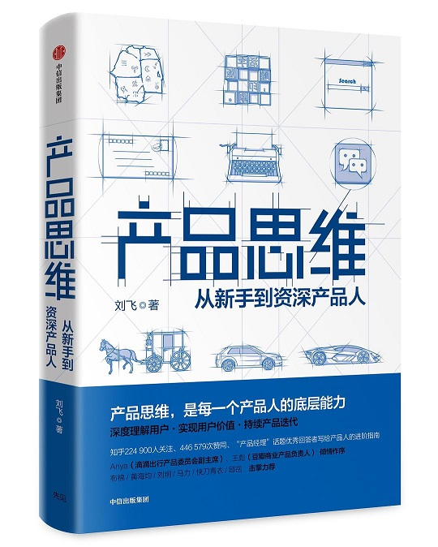

这本《产品思维》是一本很不错的产品入门读物，作者刘飞是一名资深的产品人，滴滴出行司机方向前产品负责人，点我达前产品专家，嘟嘟美甲联合创始人，锤子科技产品经理。

我们知道产品是一个很庞大的知识体系，刘飞老师从3个方面：认知用户（对外界的认知）、创造价值（内外间的交互）、产品落地（对内的理解），深入浅出的介绍了产品思维的各个部分之间的逻辑关系。

## 一、认知用户

### 1、认知基础

#### 1.1 用户画像

用户画像作为认知用户的第一步，有两个关键要素：“具体详细到个体”“真实自然感知”

“具体详细到个体”：要与后文提到的用户群体特征有所区分，用户画像要尽量具体到用户个人的方方面面。

“真实自然感知”：在调查用户画像时，尽量营造或贴近用户真实的生活工作环境，避免产生各种心理偏差（避免“社会期望偏误”、“受试者期望效应”）。

举例：

错误的用户画像：（数据层面，没有感知性认知）

- “美甲店用户”：女，31岁，北京人，服装店老板。
- “外卖用户”：男，24岁，福建人，互联网公司工程师。
- “弟弟用户”：男，54岁，河北人，滴滴快车司机。

正确的用户画像：（具体详细到个体、真实自然感知）

- 在杭州工作的小伙子李东，从浙江海边的农村来，23岁，高中文凭。学历虽然不高，但是愿意折腾，在工地上搬过砖，当作餐厅服务员，做过保安，也摆摊做过生意。最近刚找了一份送外卖的工作，因为勤恳又机灵，当上了组长，接下来希望能争取当上公司在西湖区的主管。他跟老乡们住在比较偏远的郊区，群租房，平时没事儿就一起打牌，或者联机玩《王者荣耀》。许多吃穿用品都是从淘宝或者拼多多买的。

**用户画像真实感的价值**

用户画像的种种特征和描述，延伸出来的是用户生活生活工作的环境，是他们日常的心理状态，也有他们的认知能力。

用户画像可以说是几乎所有产品决策的试金石，一旦把这个具体真实的用户角色扔到我们搭建的产品空间里去，就能发现种种问题。

**用户画像最有效的方法——跟用户见个面**

去跟用户见个面，跟他聊聊天。见面和聊天不要安排在公司，如果用类似麦肯锡咨询的标准方法去访谈，这和填写问卷没什么两样。

要聊的话，就去他真实的生活或者工作环境。如果不合适，哪怕去他平时经常去的餐馆或者公园也可以。

#### 1.2 用户群体

作为用户画像的补充，用户群体及其特征的重点在“区分”，而不是“描述”：

- 先区分：（利用用户特征来做用户群体的发掘和区分，抽象识别）区分哪些是我们的真实用户，哪些是潜在用户，哪些是我们的核心用户，哪些是边缘用户。
- 后描述：（用更具体的用户画像做用户认知和判断）要对边界内的用户有深入认知，需要深入他的心坎和生活状态，理解他的心理和场景。只有这样，才能做出好的判断，这还要借助用户画像。

**PM的核心能力：**

（建模能力）建立“可量化数据”、“用户特征”、“用户画像”之间的关联

从单一用户群体到用户群体矩阵多视角认知

1. 萌芽阶段：单一用户的群体特征，可能是指向性很明显的一个维度。
2. 一定规模阶段：有能力提供更丰富的功能和服务，需要做人群划分。
3. 规模更大阶段：形成特征与用户画像的多维矩阵体系。

**认知用户生命周期：**

用户生命周期的划分是为了区别不同的人群，对这些人群做需求分析，然后提供精准的功能或服务。

两个陷阱：

1. 生命周期的划分不是源于数据聚类，不是源于已有的方法论，而只源于对用户的认知。是要看用户群体本身是否存在明显的边界。
2. 生命周期这种划分方法是平台视角的，而不是用户视角的。在划分出人群后，该做什么，依然要根据每类用户的需求来推断。

### 2、约束条件

#### 2.1 用户场景

**什么是用户场景分析？**

考虑到产品使用的外部环境，不仅对用户有判断，对外部环境也要有判断。整体考虑到的需求，才能是最真实的需求。

物理环境（如室内、开车、紧急情况、网络异常、夜间模式）——外部因素

社会场景（开会、上班摸鱼、操作动作、语音助手）——外部因素

用户心流（心理账户）——内部因素

利用场景判断需求：场景是需求的限制条件，决定了需求的适用范围。

#### 2.2 用户心智

**用户心智是用户需求的根源：**

如果说用户是产品的根源，那么用户心智就是用户需求的根源，用户所做的每一个行为背后都是他们在具体场景下，认知某件事后的反馈，这个认知的基础是用户心智。

**用户心智函数：**

想法=F（x, y, z...），其中，参数x, y, z等便是用户当下的感知和场景；F是对用户的深入了解，可以帮助我们在条件有限的情况下快速准确地判断用户。

**社会心智：（社会对每个用户的影响）**

社会学中一个人的3个核心资源：物质或经济资源、社会资源、文化资源。

3个资源相互影响，最终影响一个人的：生活方式、消费心理、文化程度、价值观等。

社会心智的特点：相对固定、很难用外力改变、受社交圈影响。

社会心智的应用：判断用户特征、判断用户成本、建立品牌认知。

认知行为心智：（认知心理学对用户的影响）

认知心理学+行为心理学：《思考，快与慢》

用户常见的认知偏误：损失厌恶、框架效应、锚定效应、注意力偏差、主观验证、证实偏见、逆火效应、概率思维与0/1思维、知识的诅咒、峰终定律、宜家效应、间隔效应和延迟效应。

**关于用户心智的建议：**

1. 获取足够完善的用户画像和用户场景
2. 要对普遍存在的认知偏误有些了解
3. 要有极强的同理心
4. 要用科学论证的精神反复检验

### 3、真实有效的需求点

产品思维的核心就是用户和迭代，而用户思维的主要目的就是认知用户，以充分了解他的需求，弄清楚产品的价值，从而有效地做出受欢迎的产品。

1. 需求是用户对解决现存问题的需要
2. 需求不是无边界的，满足超过一定边界，边际收益会骤降
3. 用户的诉求不等于需求
4. 需求的主体是目标用户
5. 需求有其时空约束
6. 用户是需求的集合
7. 需求存在不同层次快，深层的需求持久永恒

## 二、创造价值

是否能够帮助用户解决问题，是衡量用户价值、产品价值和产品体验的标准

- 用户价值：用户使用产品时主观判断能否帮助自己解决特定问题。
- 产品价值：从产品设计的视角关注的用户价值。
- 用户体验：在实现用户价值过程中用户的主观感受。

### 1、用户价值

是用户对解决问题的主观判断。（3个要点）

1. 用户体验的主体 是用户，不是其他人定义的。
2. 用户价值是在使用产品时产生的。
3. 用户价值是主观感受

### 2、产品价值

**核心用户价值就是产品要实现的产品价值**

产品的核心价值要符合以5个要点：

1. 符合用户价值
2. 对应的旧体验较差
3. 覆盖用户够多（市场够大）
4. 简单明了
    要考虑用户心智认知的问题：用户很难认知你的产品是混合了多个价值的，也很难再心智里存储一个复杂描述。
    好的创业项目和好的商业模式，永远要一句话就能讲清楚。
5. 自己有经验或资源优势

**产品价值=（新产品用户价值-旧产品用户价值）-迁移成本**

3个误区：
1. 忽视旧体验
2. 识别了错误的旧体验
3. 忽视迁移成本

**产品价值=平均创造的用户价值*覆盖的用户数量**

### 3、用户体验

用户体验是使用产品时完整的主观感受，影响的范畴比用户价值更大。

用户体验=可用性+易用性+稳定性（+超预期体验）

**1）可用性（让用户可以达成预期目的）**

可用性是用户价值的核心。

在任何场景中，都要先确保可用性，这是用户体验的基础。如果映射到产品价值的第一个公式里，可用性差的产品，体验一定是零，没有任何商量余地。

**2）易用性（让用户达成目的的成本降低、效率提升）**

易用性是用户达成目标的成本。

若要用一个简单的词语定义易用性，就是“用户成本”。用户用任何产品完成任何任务，都是需要成本的。怎样降低这个成本，是产品在完成可用性基础上的终极目标。

建设易用性的方法：梳理产品整体体验的用户体验地图。用户体验地图讲起来简单，就是将用户在使用产品时的所有触点都一一罗列出来，并且逐个评价其优劣，横向对比影响，决定到底哪个触点的体验更需要解决（背后也是用户成本思考）。用户体验地图的核心要求有以下三点：

1. 真实触点：需要用户所有真实的触点，不管是线上还是线下。
2. 触点间关联：需要触点之间有明确关联，最好是状态机。
3. 遭遇的问题和主观感受：需要了解每个触点用户遭遇的问题和主观感受

**3）稳定性（降低不可用、不易用的概率）**

稳定性在复杂场景中有更高的要求。

面对稳定性，我们要解决两点：

1. 降低异常发生的概率。
2. 降低异常发生后的解决成本。

**4）超预期体验（让用户超过原来预期的感受）**

超预期体验并非用户体验的必要组成。

两种定义：

1. 体验比用户用来使用的产品好。
2. 使用产品的用户持续获得惊喜。

**总结：关于用户体验的4个原则：**

1. 始终优先满足可用性
2. 基于体验差酌情提升易用性
3. 降低严重异常的概率以及发生异常后的用户成本
4. 只考虑永久性的超预期体验

## 三、产品落地

产品落地（我们的产品到底该怎么构成，才能创造我们预想的价值？）的三个核心思维：供给侧能力、迭代思维、科学思维

### 1、供给侧能力

**根据供给侧给产品分类：**

1）独立品牌产品：单向提供功能和服务的产品。（百度搜索、微信、腾讯视频、爱奇艺）

特点：更关注自己完成的“功能体验”和“服务品质”

2）平台类产品：多方撮合的平台产品（淘宝、微信公众号、滴滴出行、外卖）

特点：更关注赋能给B端供给侧用户，让他们具备足够的“功能体验”和“服务体验”；逐渐有了独立品牌的特性。

**供给侧画像：（认知供给侧的起点）**

与用户画像类似，我们也需要一套供给侧的画像描述，而且这个描述应该是由用户画像、用户价值作为先决条件的，即我们需要获取什么样的用户，需要创造什么样的价值，再考量什么样的供给侧能够完成这样的逻辑，最终获取对应的供给侧角色和资源。

**供给侧场景：（检验供给侧真实程度）**

供给侧的场景的要求是把上一节里提到的供给侧角色所在的黑盒里的所有角色、资源的流转过程完全梳理清楚，不要存在模棱两可和不确定的节点。

供给侧创新：

1）模式创新

模式创新通常源于新要素进入市场，能够依赖新要素对旧模式进行改造，从而从成本和体验上达成俱佳结果的方式。

当下新要素已经相对稳定（PC、智能手机、移动流量为基础的移动互联网+移动支付时代），短时间内暂时没有新要素兴起的机会。

2）技术创新

技术创新未必指的只是工程代码那样的技术，也包括算法技术、硬件技术，甚至辅佐运营市场的技术、项目管理的技术等。

总之，是否能够利用现有的能力，让供给侧有更高效、更低成本的运作方式，都是可以做技术创新探索的。

**两类商业模式：（共同特点：规模效应）**

1）流量模式

传统的纯线上互联网产品常见的模式（百度搜索、今日头条、QQ、陌陌）

商业模式：广告、流量变现（带货）

产品分类：主产品、商业化产品

2）交易模式

基于传统行业的互联网改造带来的模式（淘宝、京东、滴滴、外卖）

商业模式：赚取中间商的差价

产品分类：平台型（滴滴、外卖）、自营型（小米、网易严选）

### 2、产品迭代

迭代思维的四个步骤，循环往复：

**1）判断最重要的体验差**（详见第一、二部分）

如果是一个从0到1到产品，那需要判断产品核心价值和用户核心体验（可用性）；

如果是一个非常成熟的产品，那要判断接下来要关注的最重要用户体验优化方向。

**2）新体验的最小成本尝试**（MVP-最小可行产品）

用最低成本去试验我们的方法是不是真的可以解决问题。

·不能过于简陋和变形，导致无法验证判断的正误；

·在这个基础上，成本最小化完成尝试的方案；

·尝试前要确定预期和判断标准。

**3）观察结果，识别正误**

数据分析师：帮助我们清晰的认知所有行为与结果之间的关联。

观察数据结果：用户反馈、行为数据

分析正误的基础：数据思维（10条）

1、分析师的核心能力是思辨

2、对讲真话负责，保持中立

3、论据充分，论证严谨，观点简明

4、数据先于观点，而不是观点先于数据

5、不要把问题复杂化，而不要惧怕复杂度

6、分析什么问题，往往比用什么方法更重要

7、好的分析是给别人输入，而不只是帮别人输出

8、分析没有什么价值，除非洞见改变了什么其他的东西

9、如果可能，应该基于问题收集数据，而不只是基于数据来问问题

10、不是所有问题都可以分析出答案，以开放的心态采纳其他的观点

**4）坚持对的，放弃错的**

了解到结果之后，接下来就是快速迭代，把正确的坚持下去，把有问题的那些错误判断、错误方案都摒弃掉。

### 3、科学思维

借鉴社会科学领域的4条有效的价值观和方法轮：

**1）尊重客观规律**

更客观中立地作为一个旁观者、一个学习者，去面对社会和用户群体，才是更合适的姿态。

**2）明确约束条件**

我们不能忽视一件事的结果是多种变量和因素导致的。人的行为在其中只是一个自变量，而不是全部自变量。

所有的决策和判断都要考虑自己和自己的产品所处的约束条件，像本书几乎所有内容，都要考虑约束条件：用户画像，用户场景，用户心智，异常体验，供给逻辑，认知偏误等，都在影响最终产品的结果。

**3）抽象有效方法**

在我们心中，仍然需要一个相对成体系的方法论模型，而且在我们做产品的过程中，它就像一个产品一样不断迭代进化，逐渐离真相更近。

值得注意的是，自己的方法论模型还是要经过实践验证。

**4）具备批判思维和证伪精神**

批判思维能帮助我们更好地迭代，实际上是迭代思维的基础。没有批判思维，就绝不可能做好迭代，因为不否认自己，不进化自己的结果就是：好的坚持，坏的也坚持。

我们的每个产品决策、对用户的认知判断，都应该是可被证伪的。有了可证伪精神，我们既可以更清楚客观地认知自己的决策和判断，也能更清楚地认知他人做出的决策和判断。